# Deploying a MERN Stack Application on AWS Cloud

A MERN Stack consists of javascript technologies used in creating full-stack applications and dynamic websites.

MongoDB: A document-based, No-SQL database used to store application data in a form of documents.

ExpressJS: A server side Web Application framework for Node.js.

ReactJS: A frontend framework, based on JavaScript used to build User Interface (UI) components.

Node.js: An open-source runtime environment for building fast and scalable server-side and networking applications.

We will be building a simple todo list application and deploying on AWS cloud EC2 machine.

## Creating EC2 Instances

We log on to AWS Cloud Services and create an EC2 Ubuntu VM instance. When creating an instance, choose keypair authentication and download private key(*.pem) on your local computer.

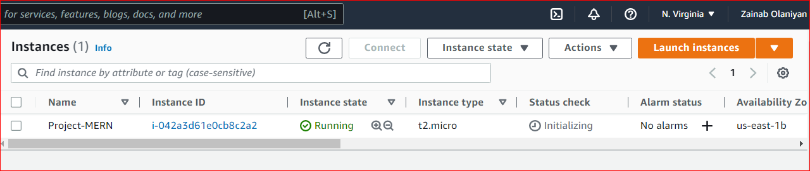

On windows terminal, cd into the directory containing the downloaded private key.Run the below command to log into the instance via ssh:

`ssh -i <private_keyfile.pem> username@ip-address`

## Backend Configuration

Run `sudo apt update` and `sudo apt upgrade` to update all default ubuntu dependencies to ensure compatibility during package installation.
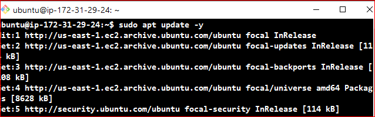
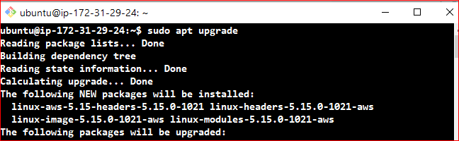

Next up will be to install nodejs, first we get the location of nodejs form the ubuntu repository using the following command. `curl -sL https://deb.nodesource.com/setup_12.x | sudo -E bash -`

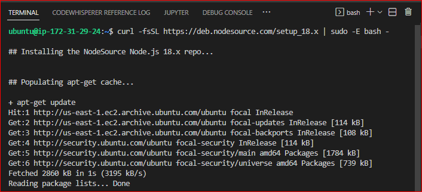

Then we run a node install: `sudo apt-get install -y nodejs`

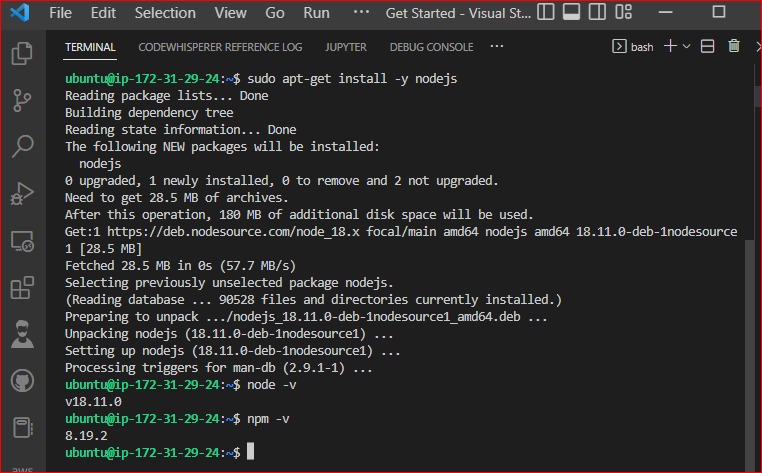

## Application Code Setup
We then create a directory that will house our codes and packages and all subdirectories to represent components of our application.
`mkdir todo`
Inside this directory we will instantiate our project using `npm init`. This enables javascript to install packages useful for spinning up our application.

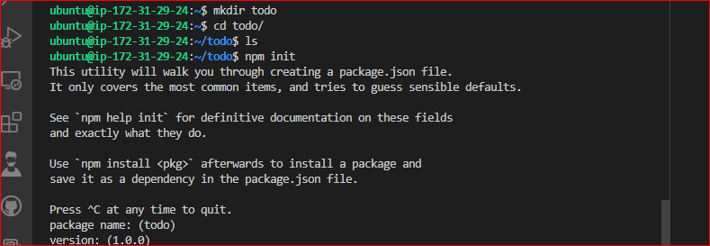

## ExpressJS Installation

We will be installing express which is nodejs framework and will be helpful when creating routes for our application via HTTP requests.
`npm install express`


Create an `index.js` file which will contain code useful for spinning up our express server

Install the `dotenv` module which is a module that loads environment variables from a `.env` file into `process.env`. The `.env` files are useful for hiding important credentials which shouldnt be exposed.
`npm install dotenv`.

Inside the `index.js` file we type the following the code as seen in the image below.

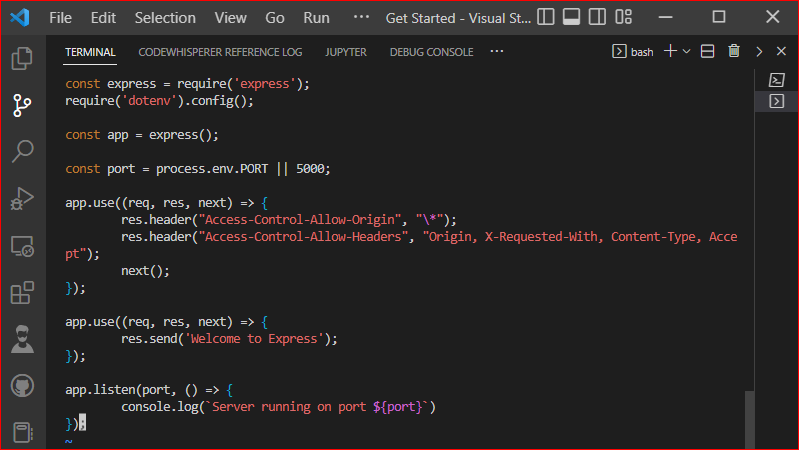

Run `node index.js` to spin up our server.

This code is useful for spinning up our application via the port specified in the code.

Allow our port as part of the inbound security rules in our EC2 instance to ensure that our server is visible via the internet.

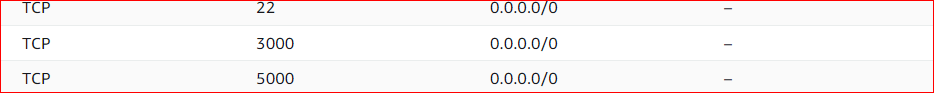

Paste our public ip address on the browser with the port to see if the server is properly configured.

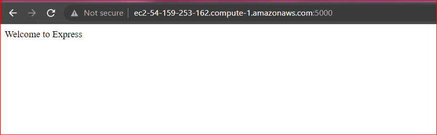

## Defining Routes For our Application

We will create a `routes` folder which will contain code pointing to the three main endpoints used in a todo application. This will contain the post,get and delete requests which will be helpful in interacting with our client_side and database via restful apis.

```
mkdir routes
cd routes
touch api.js
```

Write the The below code in `api.js`. It is an example of a simple route that fires various endpoints.

```
const express = require ('express');
const router = express.Router();

router.get('/todos', (req, res, next) => {

});

router.post('/todos', (req, res, next) => {

});

router.delete('/todos/:id', (req, res, next) => {

})

module.exports = router;
```

## Creating Models

We will be creating the models directory which will be used to define our database schema. A Schema is a blueprint of how our database will be structured which include other fields which may not be required to be stored in the database.

Inside the `todo` directory, run `npm install mongoose` to install mongoose.

Create a `models` directory and then create a file in it `todo.js` Write the below code inside the todo.js file

```
const mongoose = require('mongoose');
const Schema = mongoose.Schema;

//create schema for todo
const TodoSchema = new Schema({
action: {
type: String,
required: [true, 'The todo text field is required']
}
})

//create model for todo
const Todo = mongoose.model('todo', TodoSchema);

module.exports = Todo;
```

Since we have defined a schema for how our database should be structured, we then update the code in our `api.js` to fire specific actions when an endpoint is called.

```
const express = require ('express');
const router = express.Router();
const Todo = require('../models/todo');

router.get('/todos', (req, res, next) => {

//this will return all the data, exposing only the id and action field to the client
Todo.find({}, 'action')
.then(data => res.json(data))
.catch(next)
});

router.post('/todos', (req, res, next) => {
if(req.body.action){
Todo.create(req.body)
.then(data => res.json(data))
.catch(next)
}else {
res.json({
error: "The input field is empty"
})
}
});

router.delete('/todos/:id', (req, res, next) => {
Todo.findOneAndDelete({"_id": req.params.id})
.then(data => res.json(data))
.catch(next)
})

module.exports = router;
```

## Creating MongoDB

We will need a database to store all information when we make a post request to an endpoint. We will be using mLab which provides a DBaaS (Database as a service) solution.

Login into mLab and create a cluster

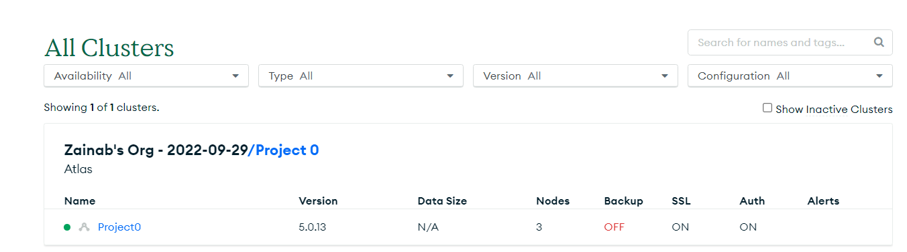

Create a database collection

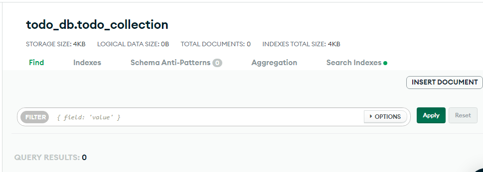

To connect mongoose(application_db) to our database service we connect to it using the connection credential provided by mLab

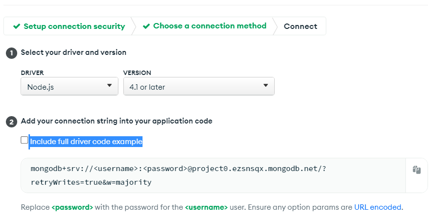

Copy the connection code and save it inside a `.env` file which should be created in the parent todo directory

`DB = 'mongodb+srv://<username>:<password>@<network-address>/<dbname>?retryWrites=true&w=majority'`

Change the username, password,database name and network address to the one specified by you when creating the database and collection.

Update the code in our `index.js` as we need to point mongoose to the database service we created using mLab

```
const express = require('express');
const bodyParser = require('body-parser');
const mongoose = require('mongoose');
const routes = require('./routes/api');
const path = require('path');
require('dotenv').config();

const app = express();

const port = process.env.PORT || 5000;

//connect to the database
mongoose.connect(process.env.DB, { useNewUrlParser: true, useUnifiedTopology: true })
.then(() => console.log(`Database connected successfully`))
.catch(err => console.log(err));

//since mongoose promise is depreciated, we overide it with node's promise
mongoose.Promise = global.Promise;

app.use((req, res, next) => {
res.header("Access-Control-Allow-Origin", "\*");
res.header("Access-Control-Allow-Headers", "Origin, X-Requested-With, Content-Type, Accept");
next();
});

app.use(bodyParser.json());

app.use('/api', routes);

app.use((err, req, res, next) => {
console.log(err);
next();
});

app.listen(port, () => {
console.log(`Server running on port ${port}`)
});
```

Then we run `node index.js` to test our connection.

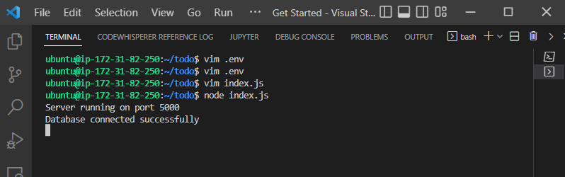

## Testing Backend Code Using Postman

So far, we have built the backend of our application and in order to test to see if it works without a frontend, we use postman to test the endpoints.

On Postman, we make a POST request to our database whilst specifying an action in the body of the request.

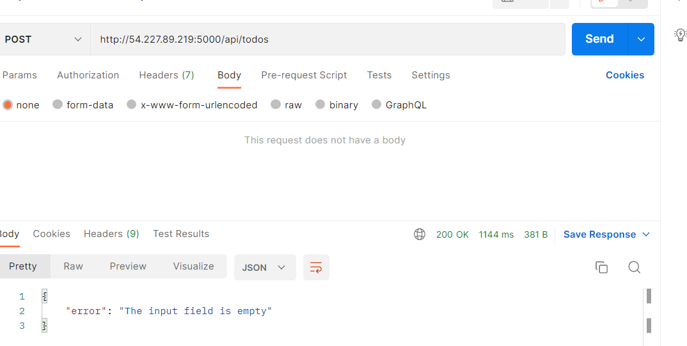

Then We make a GET request to see if we can get back what has been posted into the database.

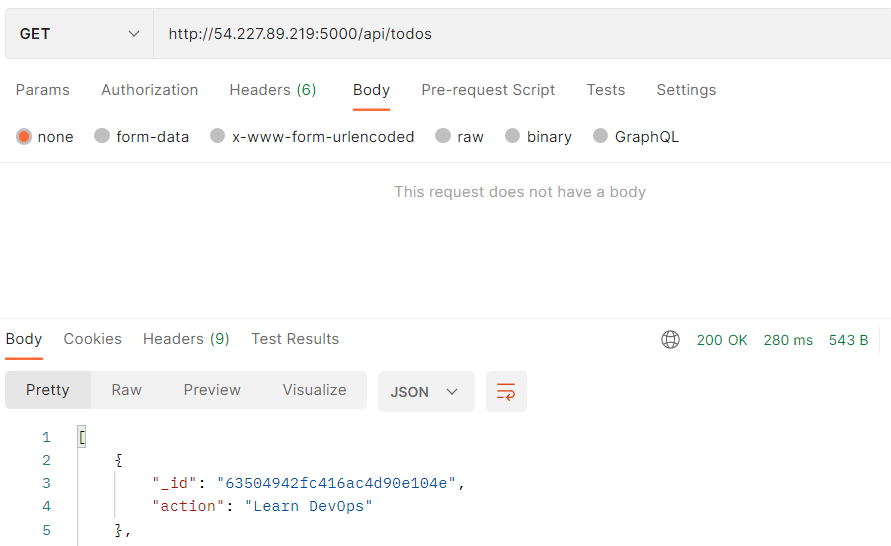

We can also make a delete request which deletes and entry using the id of each entry.


## Creating Frontend

In the todo directory which is same directory containing the backend code.
Run `npx create-react-app client`. This creates a client directory containing the necessary packages required for react to work.


We then install concurrently and nodemon which are important packages used for the build up process. Concurrently ensures that multiple commands can be run at the same time on the same terminal.

```
npm install concurrently --save-dev
npm install nodemon --save-dev
```

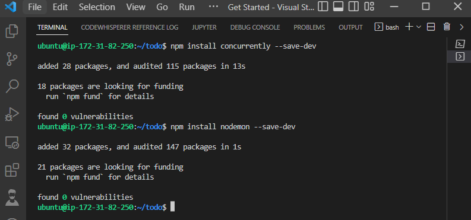

We configure `package.json` to run the new installation.

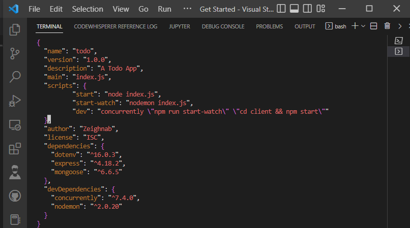

Configured proxy in package.json to ensure we access our site via using `http://localhost:5000` rather than always including the entire path like `http://localhost:5000/api/todos`.

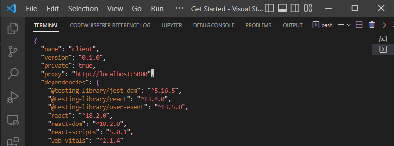

Now we run `npm run dev` inside the todo directory and the server is spinned on port `localhost:3000`. Then we set inbound security group rule for port 3000.

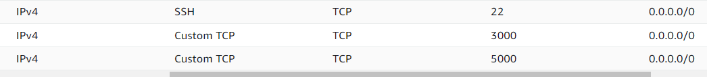

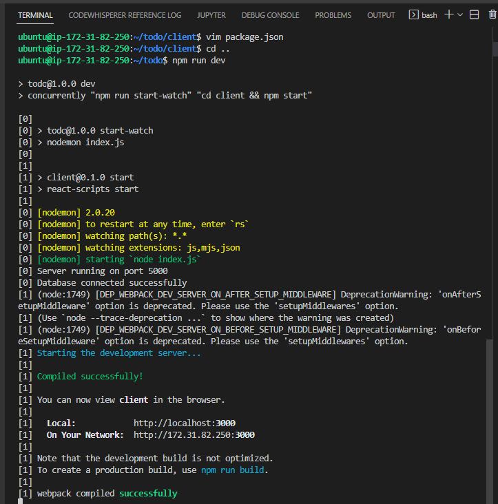

We move into the client then src directory and then create a components directory which will contain files that contains our frontend code. Inside the `components` directory we create `Input.js` `ListTodo.js` `Todo.js`.

Insert the below code into the `Input.js`.

```
import React, { Component } from 'react';
import axios from 'axios';

class Input extends Component {

state = {
action: ""
}

addTodo = () => {
const task = {action: this.state.action}

    if(task.action && task.action.length > 0){
      axios.post('/api/todos', task)
        .then(res => {
          if(res.data){
            this.props.getTodos();
            this.setState({action: ""})
          }
        })
        .catch(err => console.log(err))
    }else {
      console.log('input field required')
    }

}

handleChange = (e) => {
this.setState({
action: e.target.value
})
}

render() {
let { action } = this.state;
return (
<div>
<input type="text" onChange={this.handleChange} value={action} />
<button onClick={this.addTodo}>add todo</button>
</div>
)
}
}

export default Input
```

Ensure axios is installed in the client directory
`npm install axios`

In the `ListTodo.js` directory, insert the following code

```
import React from 'react';

const ListTodo = ({ todos, deleteTodo }) => {

return (
<ul>
{
todos &&
todos.length > 0 ?
(
todos.map(todo => {
return (
<li key={todo._id} onClick={() => deleteTodo(todo._id)}>{todo.action}</li>
)
})
)
:
(
<li>No todo(s) left</li>
)
}
</ul>
)
}

export default ListTodo
```

In the `Todo.js` directory, insert the following code

```
import React, {Component} from 'react';
import axios from 'axios';

import Input from './Input';
import ListTodo from './ListTodo';

class Todo extends Component {

state = {
todos: []
}

componentDidMount(){
this.getTodos();
}

getTodos = () => {
axios.get('/api/todos')
.then(res => {
if(res.data){
this.setState({
todos: res.data
})
}
})
.catch(err => console.log(err))
}

deleteTodo = (id) => {

    axios.delete(`/api/todos/${id}`)
      .then(res => {
        if(res.data){
          this.getTodos()
        }
      })
      .catch(err => console.log(err))

}

render() {
let { todos } = this.state;

    return(
      <div>
        <h1>My Todo(s)</h1>
        <Input getTodos={this.getTodos}/>
        <ListTodo todos={todos} deleteTodo={this.deleteTodo}/>
      </div>
    )

}
}

export default Todo;
```

In the `src` folder , create an `App.js` file which encapsulates all other components. Paste the below code

```
import React from 'react';

import Todo from './components/Todo';
import './App.css';

const App = () => {
return (
<div className="App">
<Todo />
</div>
);
}

export default App;
```

In same directory, create an `App.css` and insert the following code
```
.App {
text-align: center;
font-size: calc(10px + 2vmin);
width: 60%;
margin-left: auto;
margin-right: auto;
}

input {
height: 40px;
width: 50%;
border: none;
border-bottom: 2px #101113 solid;
background: none;
font-size: 1.5rem;
color: #787a80;
}

input:focus {
outline: none;
}

button {
width: 25%;
height: 45px;
border: none;
margin-left: 10px;
font-size: 25px;
background: #101113;
border-radius: 5px;
color: #787a80;
cursor: pointer;
}

button:focus {
outline: none;
}

ul {
list-style: none;
text-align: left;
padding: 15px;
background: #171a1f;
border-radius: 5px;
}

li {
padding: 15px;
font-size: 1.5rem;
margin-bottom: 15px;
background: #282c34;
border-radius: 5px;
overflow-wrap: break-word;
cursor: pointer;
}

@media only screen and (min-width: 300px) {
.App {
width: 80%;
}

input {
width: 100%
}

button {
width: 100%;
margin-top: 15px;
margin-left: 0;
}
}

@media only screen and (min-width: 640px) {
.App {
width: 60%;
}

input {
width: 50%;
}

button {
width: 30%;
margin-left: 10px;
margin-top: 0;
}
}
```

Create an `index.css` file and insert the below code
```
body {
margin: 0;
padding: 0;
font-family: -apple-system, BlinkMacSystemFont, "Segoe UI", "Roboto", "Oxygen",
"Ubuntu", "Cantarell", "Fira Sans", "Droid Sans", "Helvetica Neue",
sans-serif;
-webkit-font-smoothing: antialiased;
-moz-osx-font-smoothing: grayscale;
box-sizing: border-box;
background-color: #282c34;
color: #787a80;
}

code {
font-family: source-code-pro, Menlo, Monaco, Consolas, "Courier New",
monospace;
}
```

Lastly go into the root directory `todo` and run `npm run dev`. This builds up the application and spins it up.

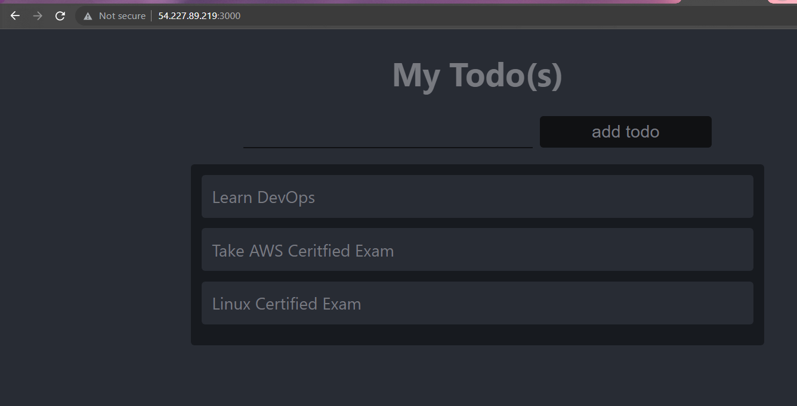