# Implementing a Client Server Architecture Using MySQL server and MYSQL client

## Project Architecture

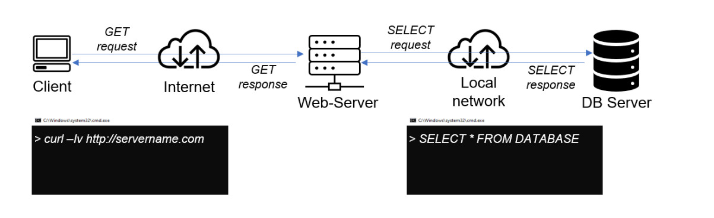

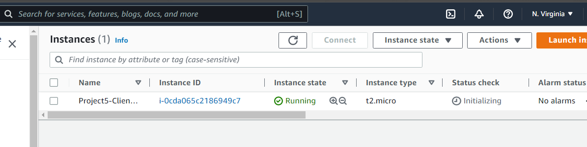

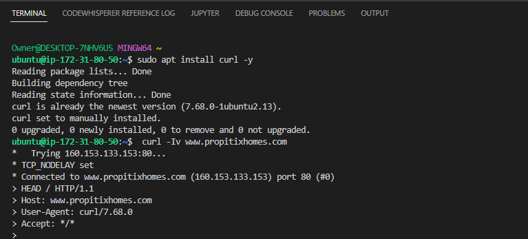

To demonstrate Client-Server architecture we will be using two Ec2 instance with mysql-server and mysql-client respectively.

* Create and configure two Linux-based virtual servers (EC2 instances in AWS). Name one instance Mysql-server the other Mysql-client
    ***Note***: Make sure they are both in same subnet

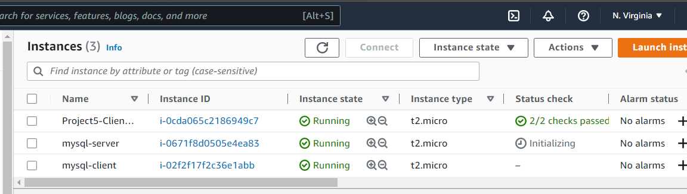

* On mysql server Linux Server, install MySQL Server software.

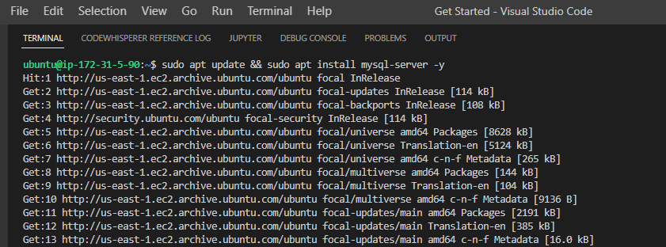

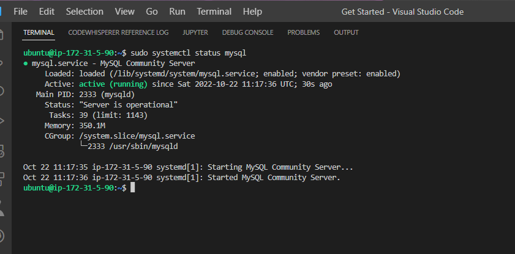

* On mysql client Linux Server, install MySQL Client software.

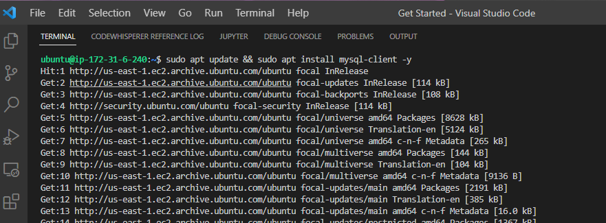

* Open port 3306 on Mysql-server allow for connection. Both server can communicate using private IPs since they belong to the same subnet.
    ***Note***: Allow access only to the specific local IP address of your ‘mysql client’, for extra security.

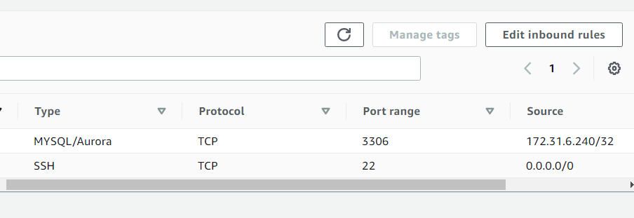

* Change bind-address on Mysql-server to allow for connection from any IP address. Set the bind-address to 0.0.0.0 using the command below:
```
sudo vi /etc/mysql/mysql.conf.d/mysqld.cnf
```

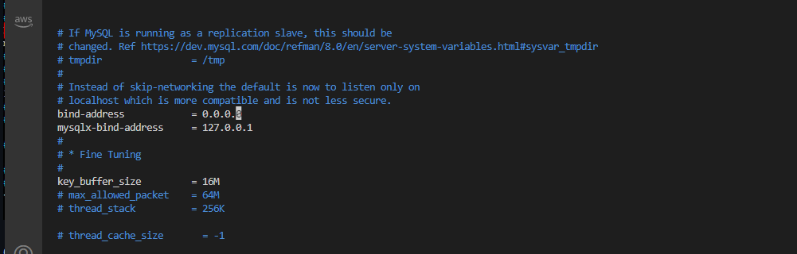

## Configure MysQL server and create database and user

* Set up the root password

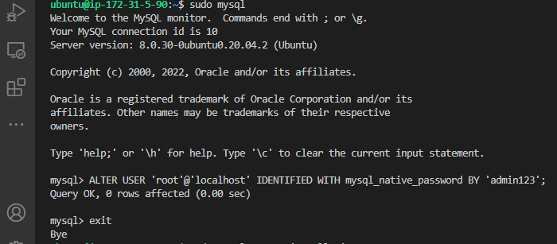

* Validate your mysql using `sudo mysql_secure_installation`


* Create user and database 

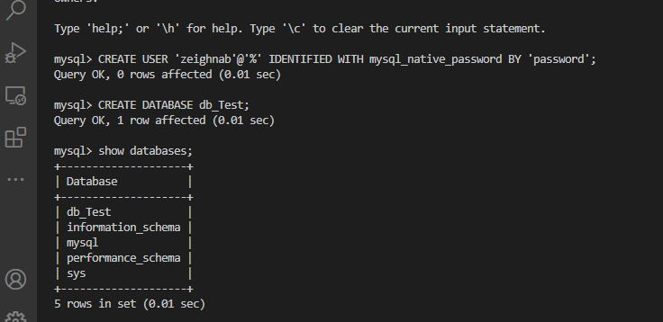

* Grant all permission on the database

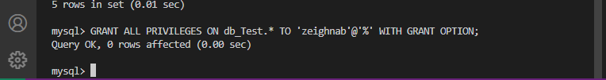

* From mysql client Linux Server connect remotely to mysql server Database Engine without using SSH. You must use the mysql utility to perform this action.

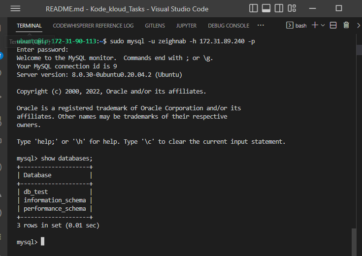