# Load Balancing With Apache

In the previous project, the concept of file sharing on multiple web servers was implemented using external NFS Server.

For the website solution implemented, how can we balance users request traffic across the 3 web servers we setup ([horizontal Scaling](https://www.cloudzero.com/blog/horizontal-vs-vertical-scaling)) so as not to put excess load on a single server whilst the others are idle.

We implement a Load Balancing solution using apache2 so as to handle routing users request to our web servers.


## Implementation

* Create an EC2 Instance(Ubuntu), which serves as load balancer to the webservers.

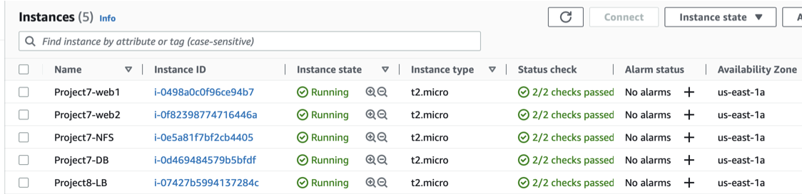
   * Open TCP port 80 in the load balancer's inbound rules to route traffic.

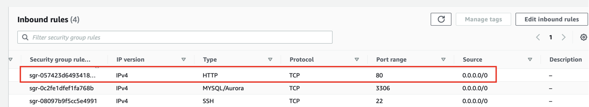

## Installing Packages
 
* Install Apache2 and configure it to point traffic coming to LB to the webservers by enabling proxy and proxy_balancer. 
```
# Installing apache2
sudo apt update -y
sudo apt install apache2 -y
sudo apt-get install libxml2-dev -y
```

```
#Enable following modules:
sudo a2enmod rewrite
sudo a2enmod proxy
sudo a2enmod proxy_balancer
sudo a2enmod proxy_http
sudo a2enmod headers
sudo a2enmod lbmethod_bytraffic
```

```
#Restart apache2 service
sudo systemctl restart apache2
sudo systemctl status apache2
```

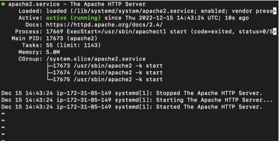

## Configuring Load Balancer

* Edith the `000-default.conf` file to add the backend web servers into the loadbalancers proxy for routing.
```
sudo vi /etc/apache2/sites-available/000-default.conf
```

```
#Add this configuration into this section <VirtualHost *:80>  </VirtualHost>

<Proxy "balancer://mycluster">
    BalancerMember http://<WebServer1-Private-IP-Address>:80 loadfactor=5 timeout=1
    BalancerMember http://<WebServer2-Private-IP-Address>:80 loadfactor=5 timeout=1
    ProxySet lbmethod=bytraffic
    # ProxySet lbmethod=byrequests
</Proxy>

ProxyPreserveHost On
ProxyPass / balancer://mycluster/
ProxyPassReverse / balancer://mycluster/
```


* Note: `bytraffic` balancing method distributes incoming traffic between webservers according to the current traffic load. `loadfactor` parameter controls the proportion at which the load is distributed. 
Other methods of routing traffic are `bybusyness`, `byrequests` and `heartbeats` and all can be specified in `ProxySet lbmethod=?`

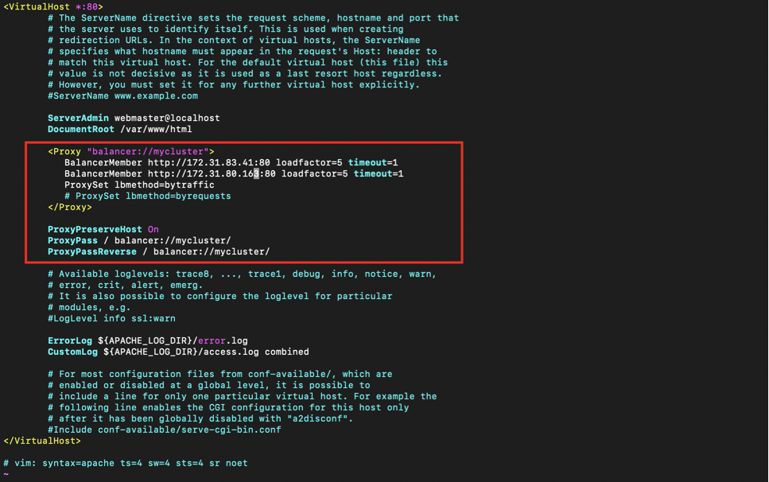

* Restart apache2 server
```
sudo systemctl restart apache2
```

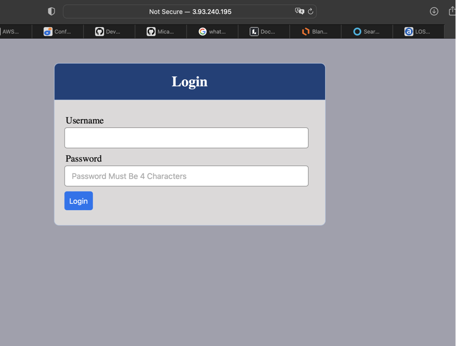

* To confirm that traffic is routed evenly to both web servers as the load balancer server is receiving traffic (which in our case is by refreshing the webpage) we can check the logs both servers receive `sudo tail -f /var/log/httpd/access_log`

Server 1

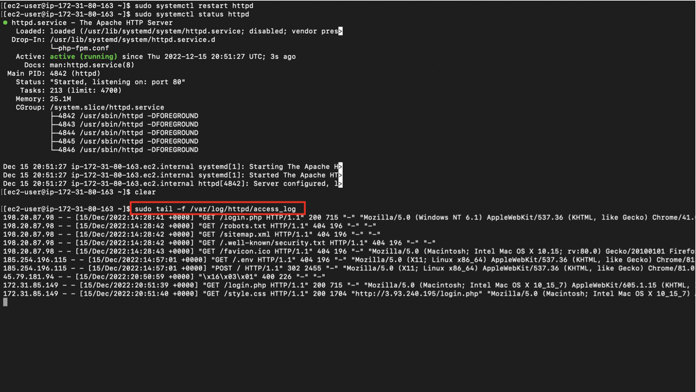

Server 2

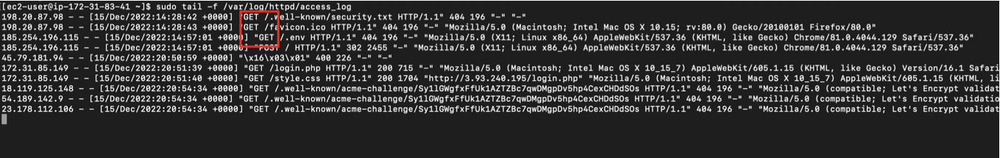

## Configuring DNS Names (Locally)

* In order not to always provide webserver private ip address whenever a new web server needs to be added on the list of loadbalancer proxy, we can specify them on the hosts file and provide a domain name for each which suites us.
```
sudo vi /etc/hosts
```

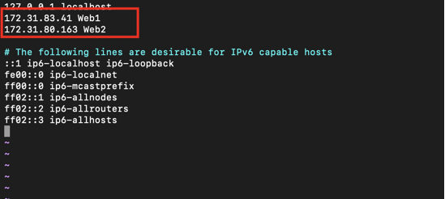

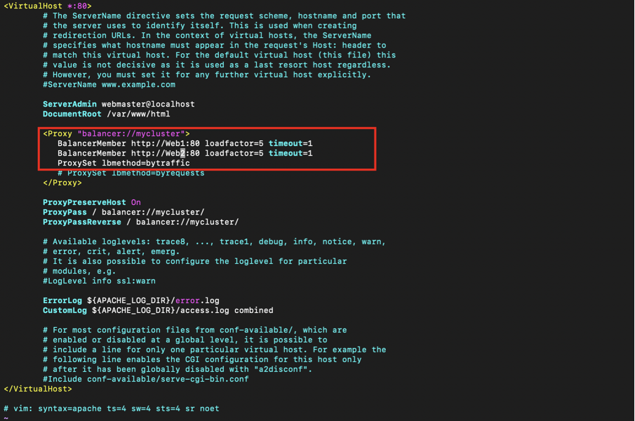

* To see this is play we can curl our dns name on the loadbalancer server. Since the DNS names are local DNS configuration we can only access them locally hence the loadbalancer uses them locally to target the backend web servers

Web1

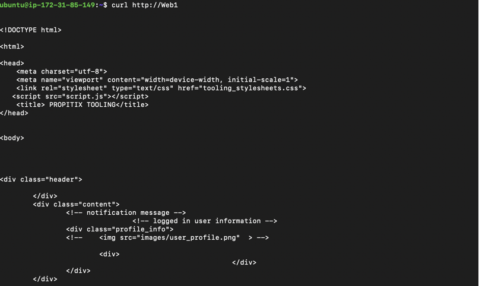

Web2

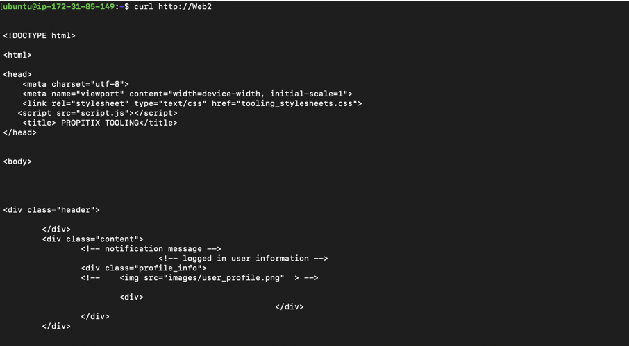