# Deploying a LAMP Stack Web Application on AWS Cloud

A LAMP Stack is a typical framework used in the development of web applications or software products. It comprises of Linux, Apache, MySQL, and Python,Perl or PHP.

Linux: This is an operating systtem on which the application is created, and it is also used in its deployment.

Apache: This is a web server that processes requests and serves web assets and content via HTTP

MySQL: A relational database management system used in creating and maintaining dynamic databases.

Python, Perl or PHP: A programming language used in execution of the web application.

## Creation of an EC2 Instance
We create an EC2 Ubuntu VM instance on AWS and and download the .pem key

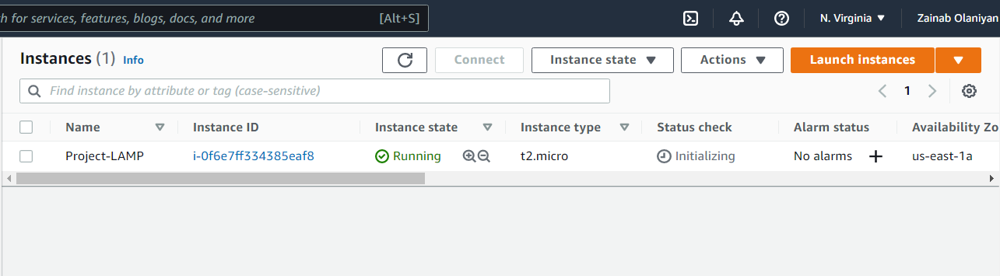

on git bash, `cd` into the directory containing the .pem key and `ssh` into the instance

`ssh -i <privatekey.pem> username@ip-address`

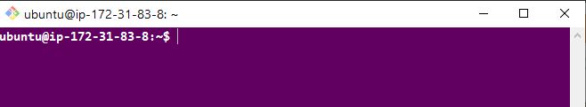

## Setting Up Apache Web Server

Install apache web server using ubuntu package manager apt:
`$ sudo apt install apache2 -y`

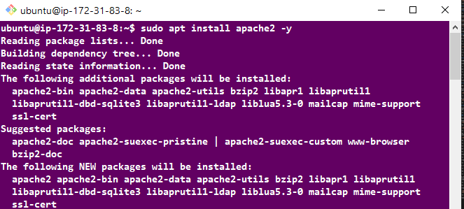

#starting apache2 server
`$ sudo systemctl start apache2`

#enable apache2 to start automatically upon system boot
`$ sudo enable apache2`

#checking apache2 status
`$ sudo systemctl status apache2`

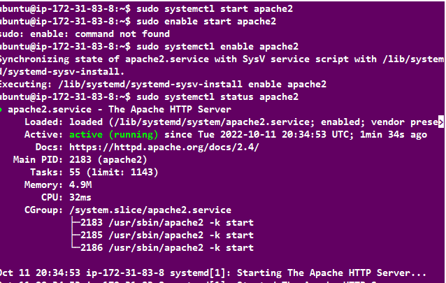

Green text indicate that the service is active and running

## Configuring Security Group Inbound Rule on EC2 Instance
A Security Group acts as a virtual firewall for EC2 instances to control incoming (Inbound), and outgoing traffic (Outbound).

We need to open the TCP port 80 to allow inbound rule to ensure the webpages are being accessed on the internet.

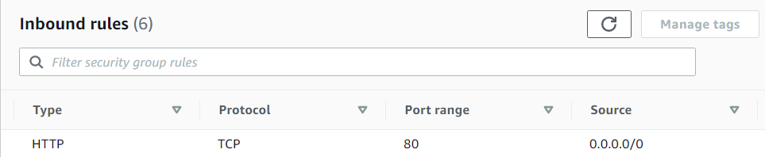

To check the accessbility of our web server on the internet, we curl the IP address/DNS name of our localhost

`curl http://127.0.0.1:80 or curl http://localhost:80`

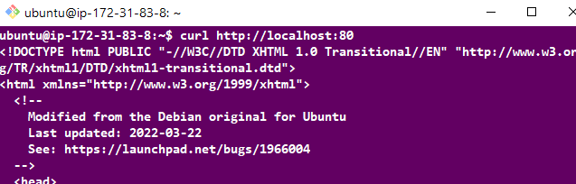

To check if our web application server can respond to requests, use the public ip address of our instance on a web browser. `http://<Public-IP-Address>:80`

## Installing MySQL

MySQL is a relational database that helps store and manage data.

Install mysql using `$ sudo apt install mysql-server -y`

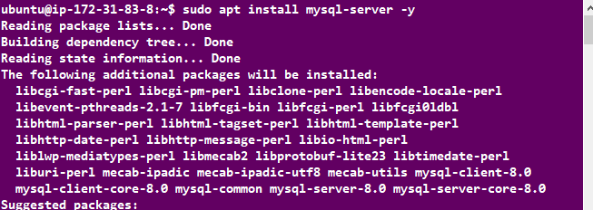

To connect MySQL server as the administrative database root, run
`sudo mysql`

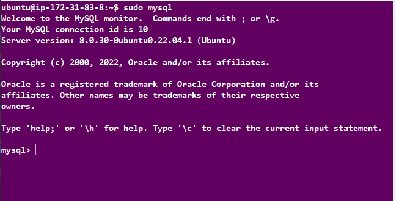

Set password for root user `ALTER USER 'root'@'localhost' IDENTIFIED WITH mysql_native_password BY '<password>';`, then `exit`

Use the `sudo mysql_secure_installation` command to remove insecure default settings and enable protection for the database.

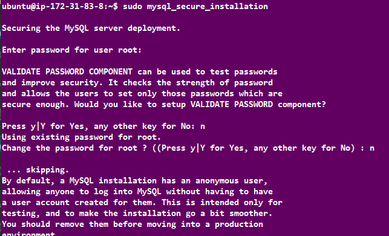

On successful secure configuration, `sudo mysql -p` on the terminal to have access to the MySQL DB.

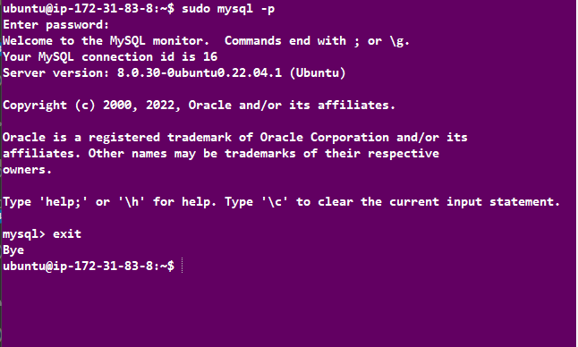

Exit from MySQL terminal using `exit`

## Installing PHP

PHP serves as a programming language which is useful for dynamically displaying contents of the webpage to users who make requests to the webserver.

We need to install php alongside its modules, `php-mysql` which is php module that allows php to communicate with the mysql database, `libapache2-mod-php` which ensures that the apache web server handles the php contents properly.

`sudo apt install php php-mysql libapache2-mod-php`.

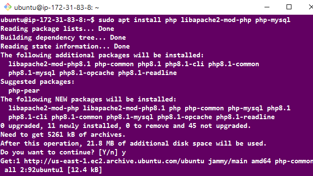

On successfull installation of php and its modules we can check the version to see if it was properly installed.
`php -v`

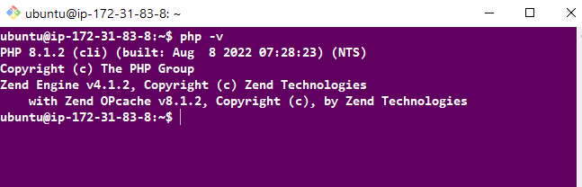

## Deploying on Apache's VirtualHost

Next we set up a virtual host using apache to enable us deploy our webcontent on the webserver. Apache's virtualhosting ensures that one or more websites can run on a webserver via different IP addresses.

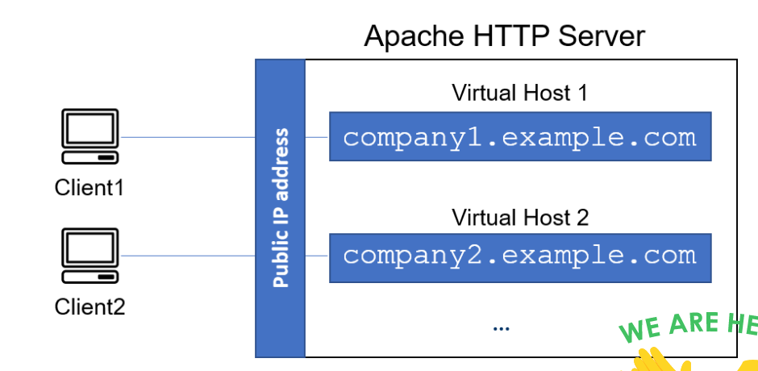

### Creating Web Domain

Apache webserver serves a website by the way of server blocks inside its `/var/www/` directory, and it can support multiple of this server blocks to host other websites.

Here we create a new directory called `projectlamp` inside the `/var/www/` directory.
`sudo mkdir /var/www/projectlamp`

The we change permissions of the `projectlamp` directory to the current user system

`sudo chown -R $USER:$USER /var/www/projectlamp`

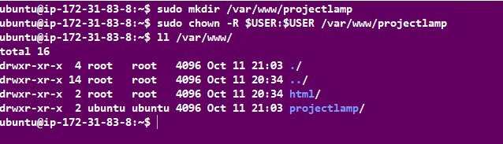

The projectlampstack directory represents the directory which will contains files related to our website as it represents a new server block on the apache webserver. In order to spin up this server block we need to configure it by creating a `.conf` file.

`sudo vi /etc/apache2/sites-available/projectlamp.conf`

The following represents the configuration needed to spin up the server block. Copy and paste into the editor.

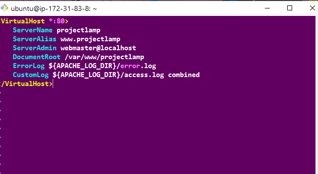

Run `esc :wq` to save and terminate vi editor.

Run `sudo a2ensite projectlamp` to activate the server block.

Run `sudo a2dissite 000-default` to deactivate the default webserver block that comes with apache on default.

Reload the apache2 server `sudo systemctl reload apache2`

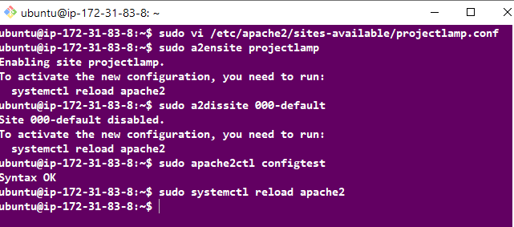

Create an index.html file inside the `/var/www/projectlamp`

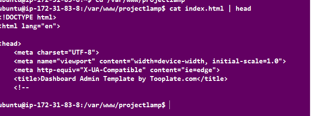

Go to the broswer and open the webpage `http://<public_ip_address>:80`

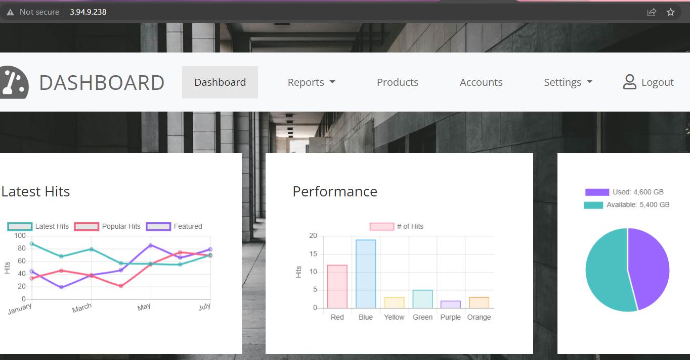

By default, the webserver has a preference for serving an index.html file based on the order of precedence by default in the DirectoryIndex settings of Apache.
To serve an index.php containing the server-side code, you’ll need to edit the `/etc/apache2/mods-enabled/dir.conf` file and change the order in which the index.php file is listed within the DirectoryIndex.

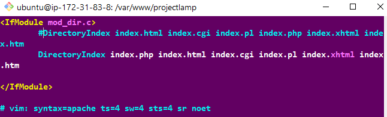

Run the `sudo systemctl reload apache2` to restart the apache2 web server for the changes made to the DirectoryIndex to take effect.

Create an index.php file in our webserver block and add the following code using the vim editor

`<?php`
`phpinfo();`

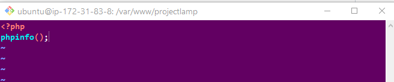

Input the instance public ip address on a web browser

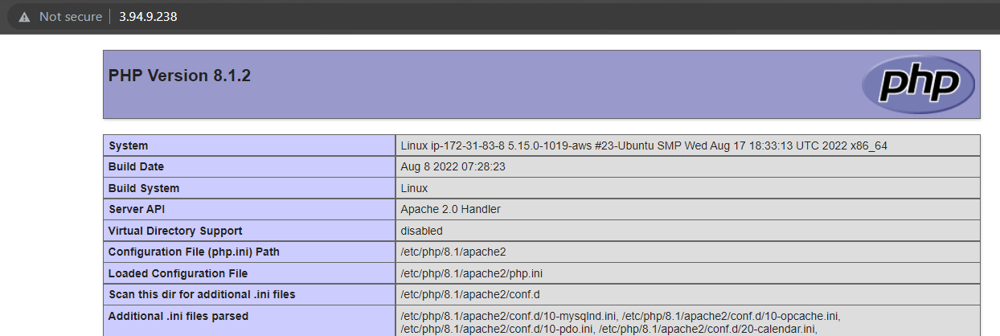
