# Deploying a LEMP Stack Web Application on AWS Cloud

As opposed to LAMP Stack Application, LEMP uses Nginx as a web server to host the web application.
NGINX is an open source software for web serving, reverse proxying, caching, load balancing, media streaming, and more.

## Creating EC2 Instance
Login to AWS Cloud Service console and create an Ubuntu EC2 instance. The virtual machine is a linux operating system which serves as the backbone for the LEMP Stack web application.

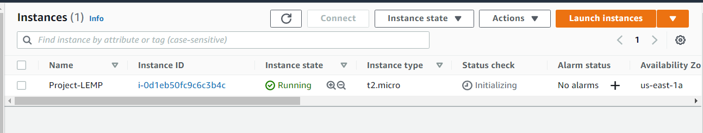

Login into the instance via ssh:

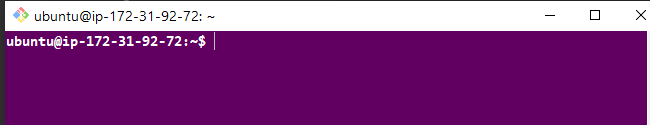

## Installing Nginx

Run `sudo apt update` to update packages from all configured sources

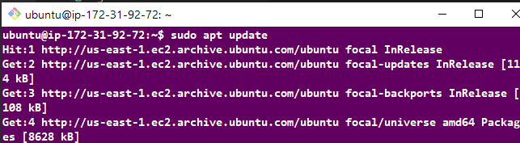

`sudo apt install nginx -y`

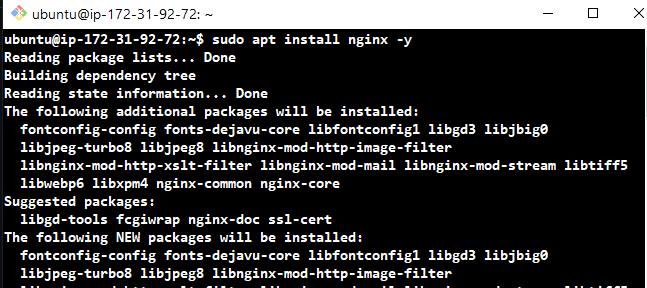

Start nginx server and enable it to automatically starts on system reboot by running the following commands

`sudo systemctl start nginx`
`sudo systemctl enable nginx`

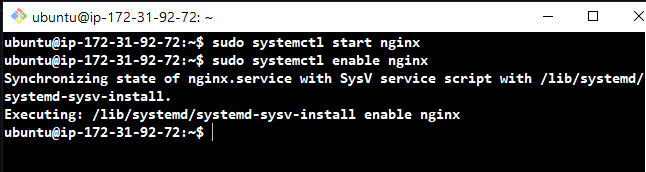

Run `sudo systemctl status nginx` to ensure the server is running. A green text indicate successful running.

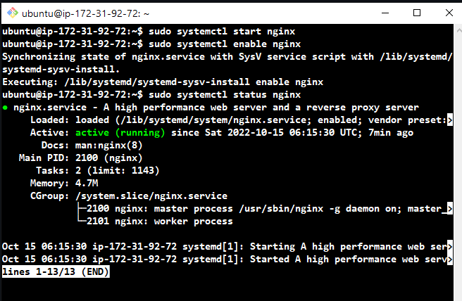

Accessing the default nginx web server block to see if everything works correctly. `curl` the local IP address of our local machine which in most case is `127.0.0.1` or the DNS name localhost on any web browser on our local machine.
`curl http://127.0.0.1:80 or curl http://localhost:80`

The below result shows nginx has been properly set up and we can deploy our web application.

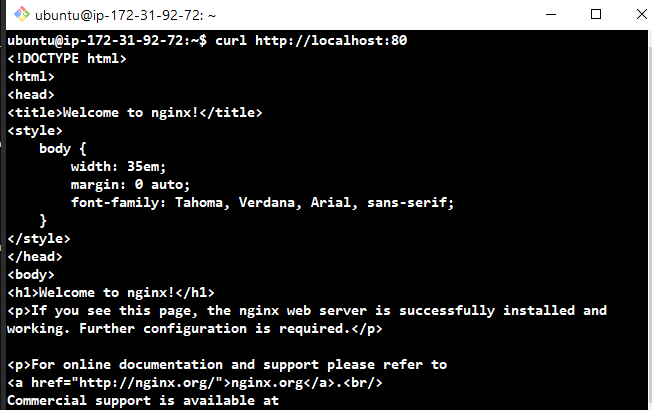

When we insert our public IP address on our browser, the nginx default webpage displayed because our instance security group allow traffic from nginx webserver via port 80.

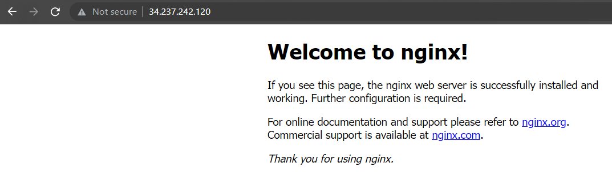

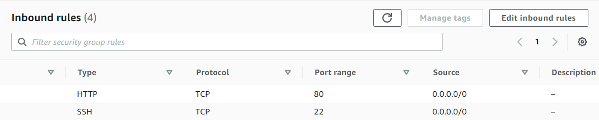

## Installing MySQL

MySQL is a relatational database that helps store and manage data.

Run `sudo apt install mysql-server -y`

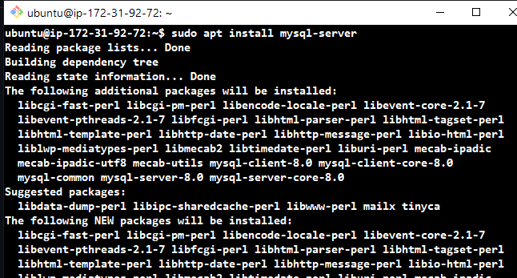

To connect MySQL server as the administrative database root, run `sudo mysql`
Set password for root user `ALTER USER 'root'@'localhost' IDENTIFIED WITH mysql_native_password BY '<password>';`, then `exit`

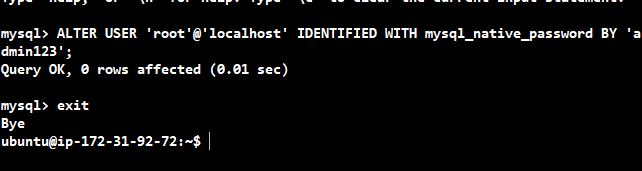

Use the `sudo mysql_secure_installation` command to remove insecure default settings and enable protection for the database.

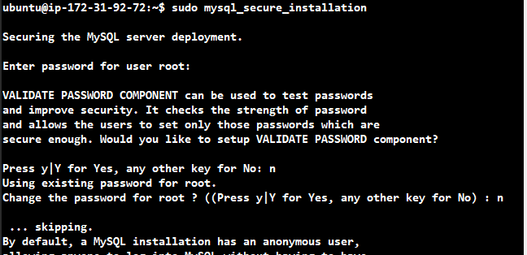

On successful secure configuration, `sudo mysql -p` on the terminal to have access to the MySQL DB, then `exit`.

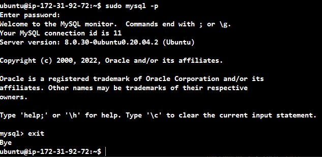

## Installing PHP

We use php to dynamically display contents of our webpage to users who make requests to the webserver.

Run `sudo apt install php-fpm php-mysql -y`

`php-fpm : which stands for PHP FastCGI Process Manager is a web tool used for speeding up the performance of a website by handling tremendous amounts of load simultaneously.`

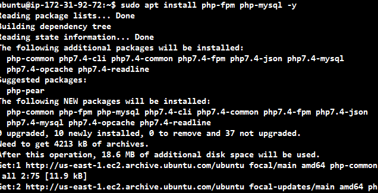

## Creating a Server block for our web application

To serve our webcontent on our webserver, we create a directory for our project inside the `/var/www/` directory.

`sudo mkdir /var/www/projectlemp` Then we change permissions of the projectlampstack directory to the current user system

`sudo chown -R $USER:$USER /var/www/projectlemp`

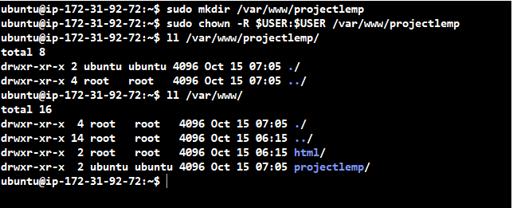

## Creating a configuration for our server block
`sudo vim /etc/nginx/sites-available/projectlemp`

The following snippets represents the configuration required for our web server block to be functional

```
#/etc/nginx/sites-available/projectlemp

server {
    listen 80;
    server_name projectLEMP www.projectlemp;
    root /var/www/projectlemp;

    index index.html index.htm index.php;

    location / {
        try_files $uri $uri/ =404;
    }

    location ~ \.php$ {
        include snippets/fastcgi-php.conf;
        fastcgi_pass unix:/var/run/php/php7.4-fpm.sock;
     }

    location ~ /\.ht {
        deny all;
    }

}
```

We then link the configuration file to the sites-enabled directory

`sudo ln -s /etc/nginx/sites-available/projectlemp /etc/nginx/sites-enabled`

To test our configuration for errors we run
`sudo nginx -t`

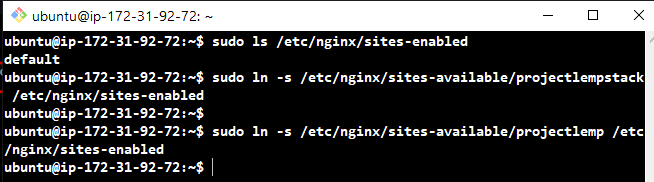

Currently our new server block has been created and configured but currently the default server block is the default block that comes with nginx install. To unlink it we `sudo unlink /etc/sites-available/default`.

We then reload nginx for all configurations to take effect sudo reload nginx.

Create an index.html file inside projectlempstack directory and write in contents to be accessed over the internet. Paste public IP address on a browser to see content.
`http://<public-ip>:80`

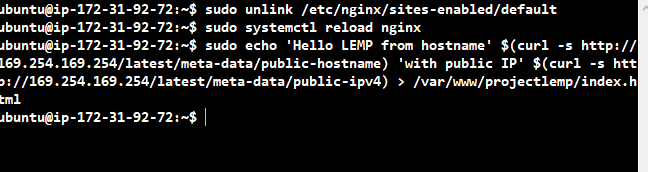

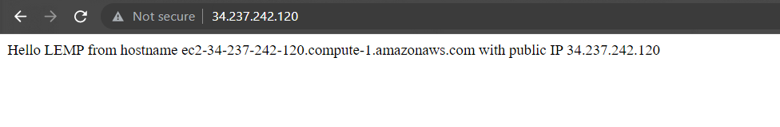

## Testing PHP Using Nginx

Create an `info.php file` inside the `/var/www/projectlempstack directory`.

On a browser enter `http://<public-ip>/info.php`

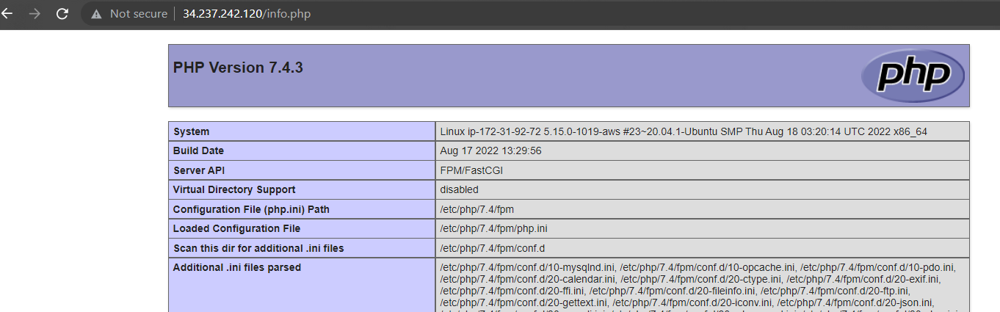

## Connecting PHP with MySQL and Fetching Content

Login into our mysql-server `sudo mysql`.

Create a new database `CREATE DATABASE <db_name>`

Create a new user and assign user a password `CREATE USER 'db_user'@'%' IDENTIFIED WITH mysql_native_password BY 'db_password';`.

Grant the user permission over the created database `GRANT ALL ON 'db_name'.* TO 'db_user'@'%';`

exit from the mysql-server in which we are currently logged in as root user and then Login into mysql server using the created user.

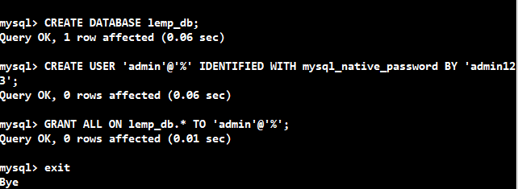

`mysql -u lemp_user -p`

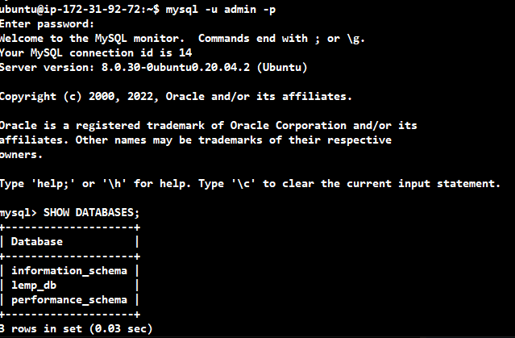

We create a table for the current user inside the lemp_db database and specify content parameters

```
CREATE TABLE lemp_db.todo_list(
    item_id INT AUTO_INCREMENT,
    content VARCHAR(255),
    PRIMARY KEY (item_id)
);
```

Push in contents into the table `INSERT INTO lemp_db.todo_list(content) VALUES ('enter contents')`

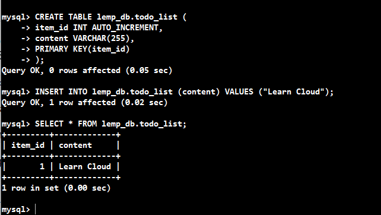

Create a php file `todo_list.php` in `/var/www/projectlemp` directory and paste the following code

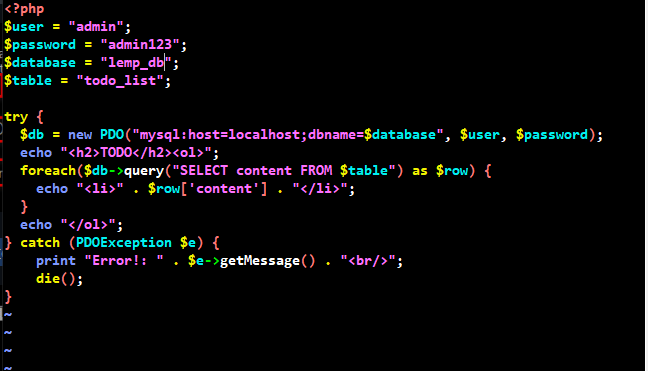

We can then access our webpage via a browser `http://<publicIP>/todo_list.php`

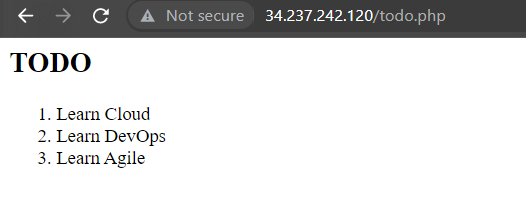