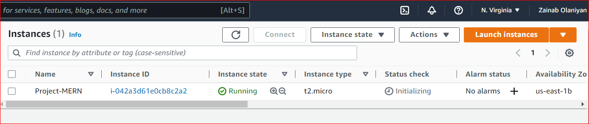
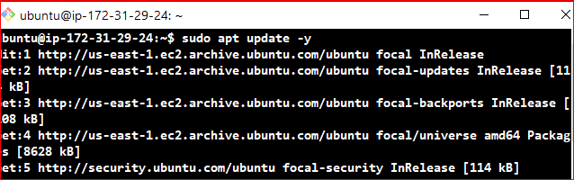
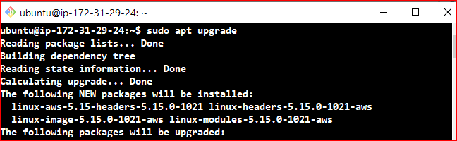
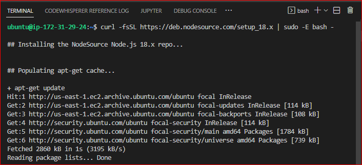
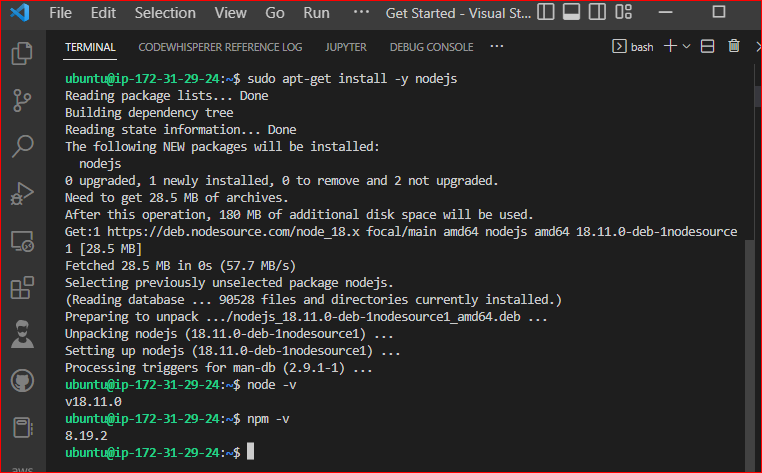
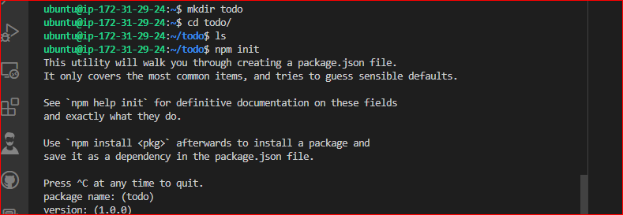
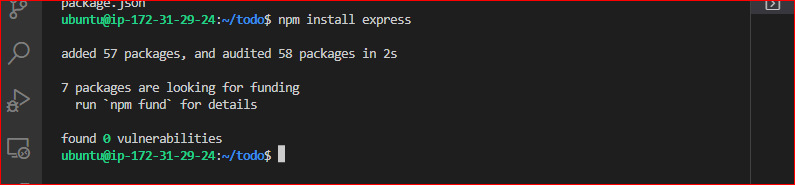
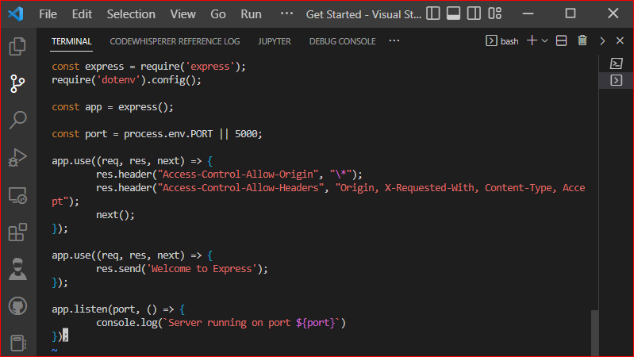
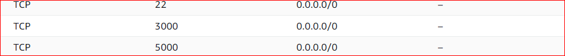
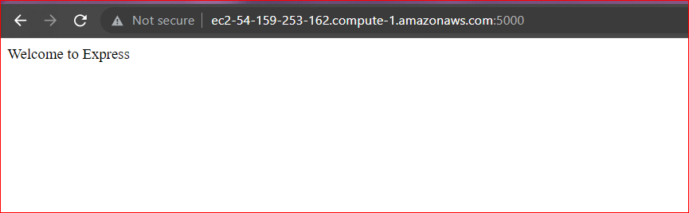

# Deploying a MERN Stack Application on AWS Cloud

A MERN Stack consists of javascript technologies used in creating full-stack applications and dynamic websites.

MongoDB: A document-based, No-SQL database used to store application data in a form of documents.

ExpressJS: A server side Web Application framework for Node.js.

ReactJS: A frontend framework, based on JavaScript used to build User Interface (UI) components.

Node.js: An open-source runtime environment for building fast and scalable server-side and networking applications.

We will be building a simple todo list application and deploying on AWS cloud EC2 machine.

## Creating EC2 Instances

We log on to AWS Cloud Services and create an EC2 Ubuntu VM instance. When creating an instance, choose keypair authentication and download private key(*.pem) on your local computer.



On windows terminal, cd into the directory containing the downloaded private key.Run the below command to log into the instance via ssh:

`ssh -i <private_keyfile.pem> username@ip-address`

## Backend Configuration

Run `sudo apt update` and `sudo apt upgrade` to update all default ubuntu dependencies to ensure compatibility during package installation.



Next up will be to install nodejs, first we get the location of nodejs form the ubuntu repository using the following command. `curl -sL https://deb.nodesource.com/setup_12.x | sudo -E bash -`



Then we run a node install: `sudo apt-get install -y nodejs`



## Application Code Setup
We then create a directory that will house our codes and packages and all subdirectories to represent components of our application.
`mkdir todo`
Inside this directory we will instantiate our project using `npm init`. This enables javascript to install packages useful for spinning up our application.



## ExpressJS Installation

We will be installing express which is nodejs framework and will be helpful when creating routes for our application via HTTP requests.
`npm install express`



Create an `index.js` file which will contain code useful for spinning up our express server

Install the `dotenv` module which is a module that loads environment variables from a `.env` file into `process.env`. The `.env` files are useful for hiding important credentials which shouldnt be exposed.
`npm install dotenv`.

Inside the `index.js` file we type the following the code as seen in the image below.



Run `node index.js` to spin up our server.

This code is useful for spinning up our application via the port specified in the code.

Allow our port as part of the inbound security rules in our EC2 instance to ensure that our server is visible via the internet.



Paste our public ip address on the browser with the port to see if the server is properly configured.



## Defining Routes For our Application

We will create a `routes` folder which will contain code pointing to the three main endpoints used in a todo application. This will contain the post,get and delete requests which will be helpful in interacting with our client_side and database via restful apis.

```
mkdir routes
cd routes
touch api.js
```

Write the The below code in `api.js`. It is an example of a simple route that fires various endpoints.

```
const express = require ('express');
const router = express.Router();

router.get('/todos', (req, res, next) => {

});

router.post('/todos', (req, res, next) => {

});

router.delete('/todos/:id', (req, res, next) => {

})

module.exports = router;
```

## Creating Models

