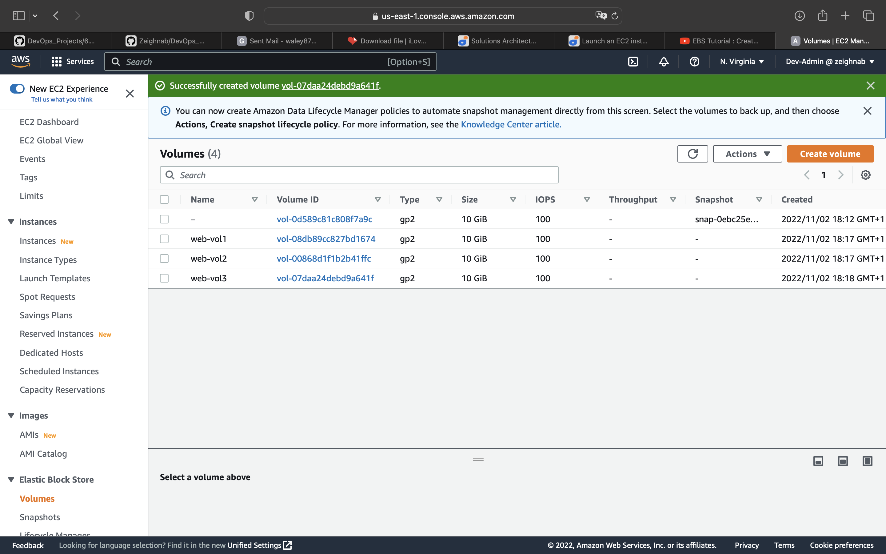
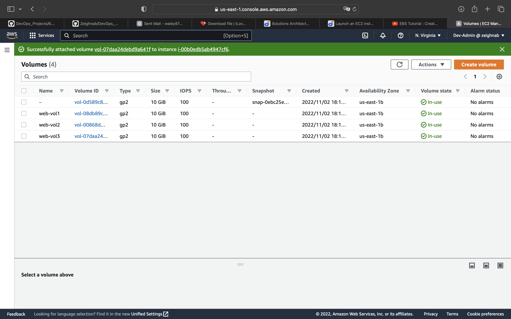
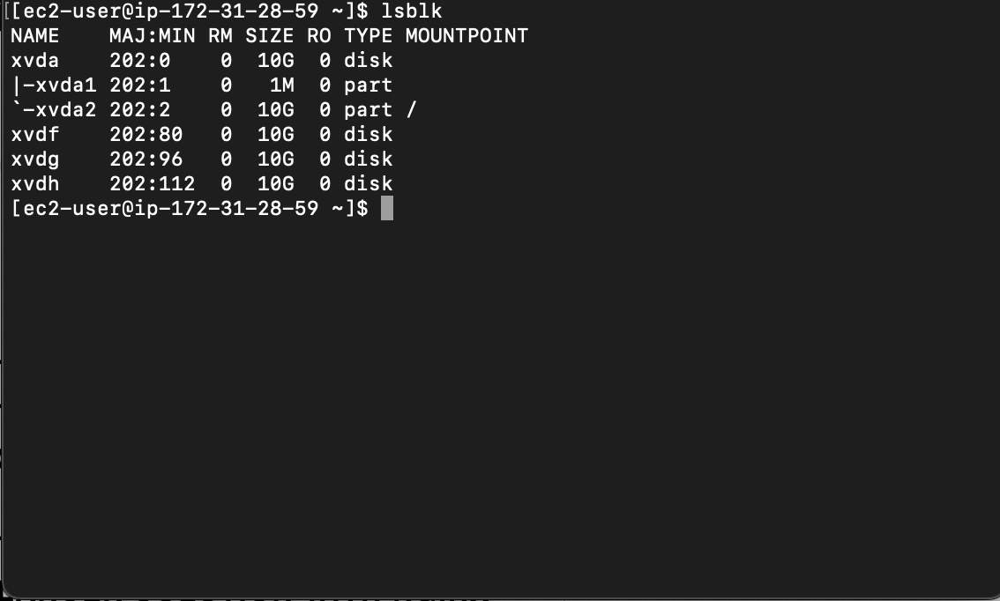
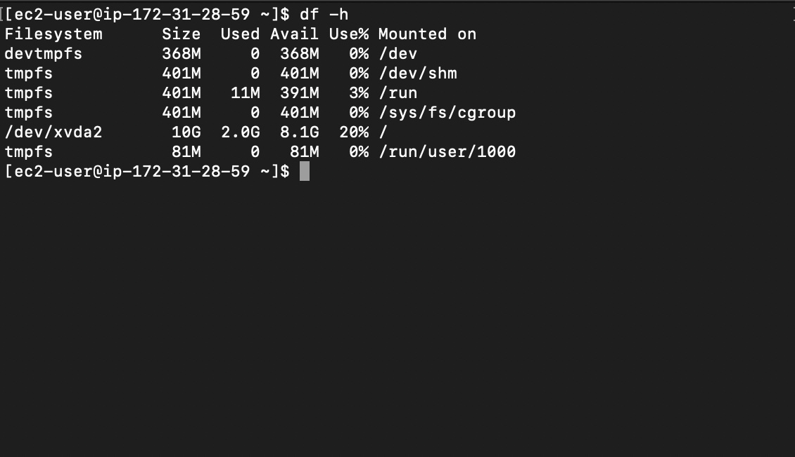
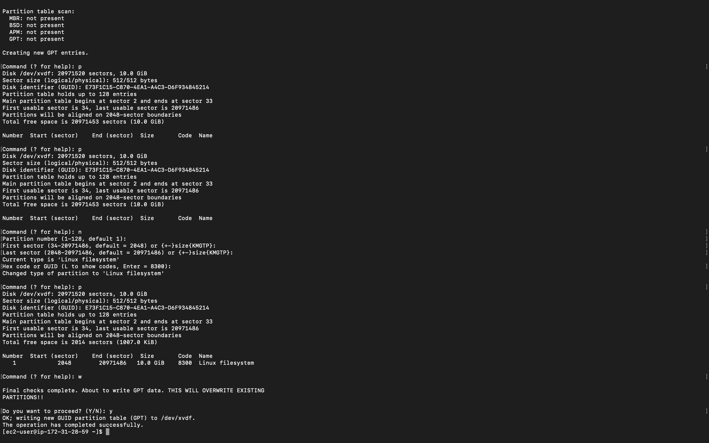
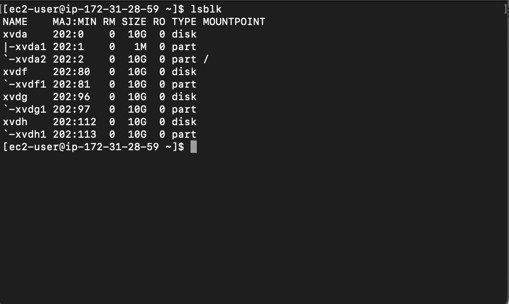
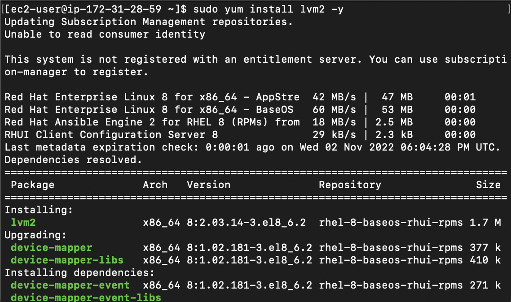
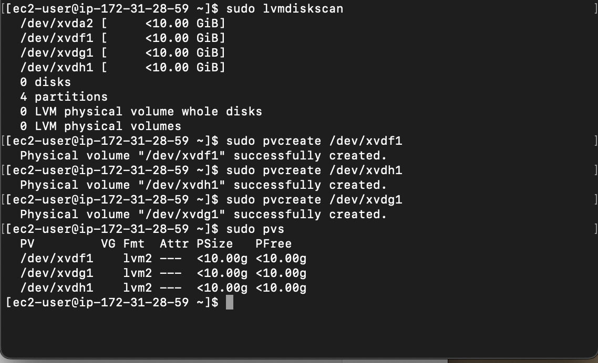
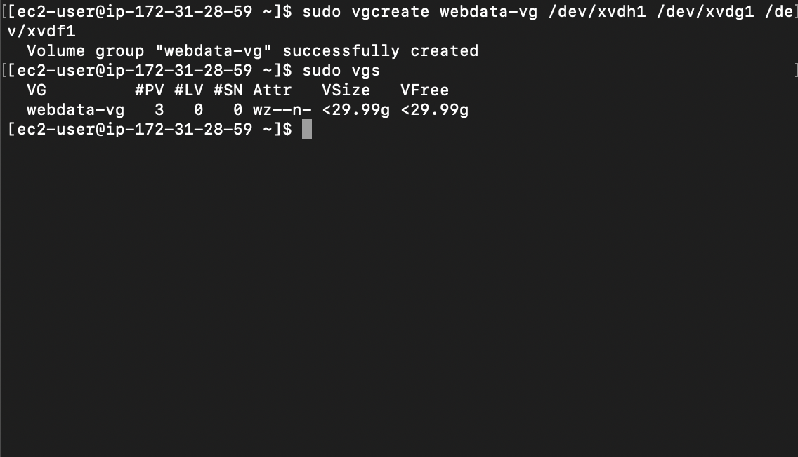

# Implementing Wordpress-Web-Solution

## 1. Preparing Web Server

* Create an EC2 instance server on AWS

* On the EBS console, create 3 storage volumes for the instance. These serves as additional external storage to our EC2 server.

* Attach the created volumes to the EC2 instance

* SSH into the instance, then view the disks attached using `lsblk` command

* View all mounts and free spaces on the server using `df -h`

* Create a partition on each volume using `gdisk`

* Install LVM2 package to create logical volumes on the server

* Create Physical Volumes on the partitioned disk volumes
`sudo pvcreate <partition_path>`

* Then, add up each physical volumes into a volume group
`sudo vgcreate <grp_name> <ppv_path1>...<pv_path1000>`

