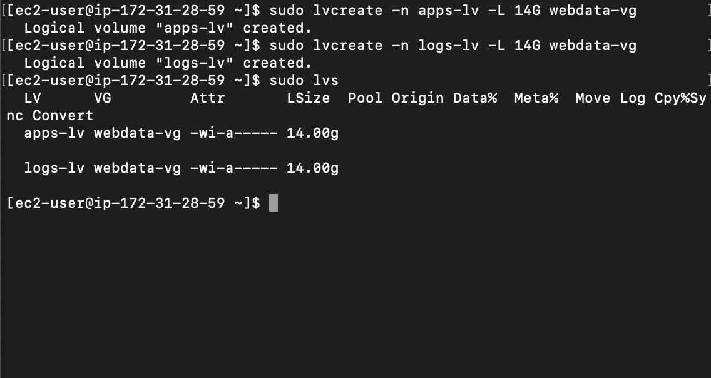
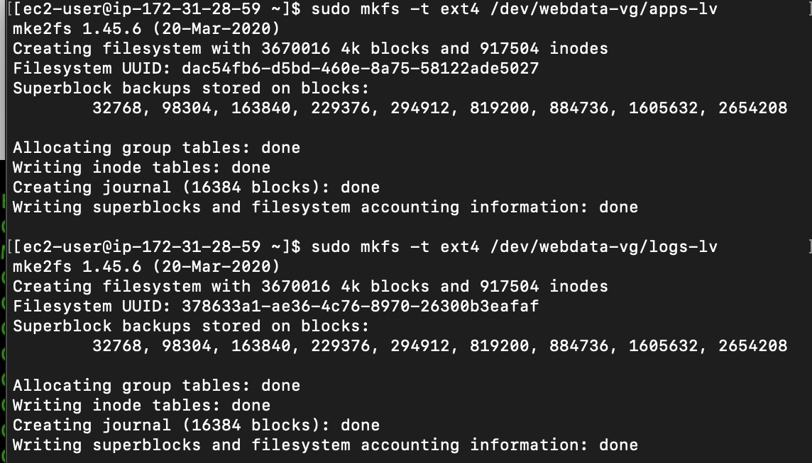
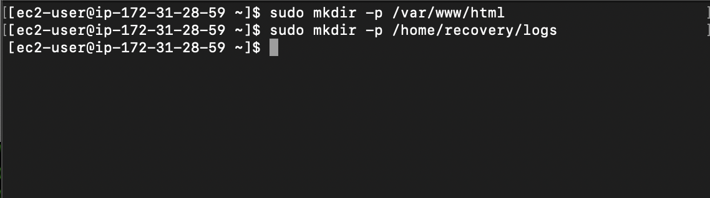
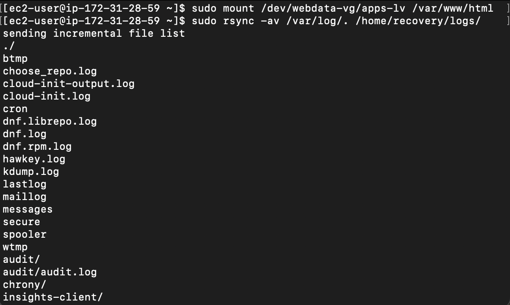
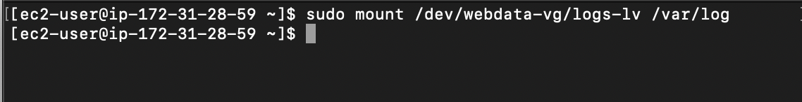
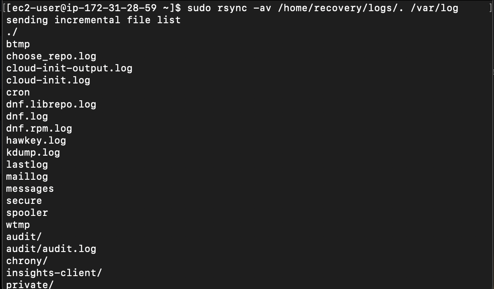
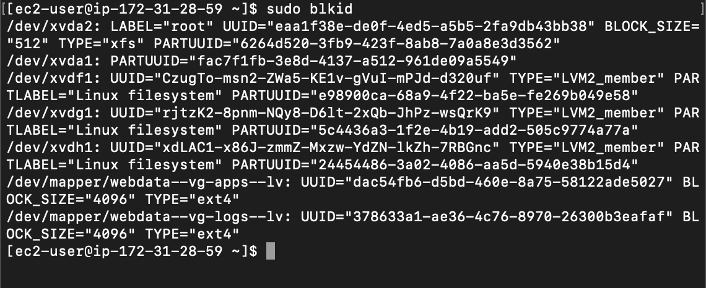
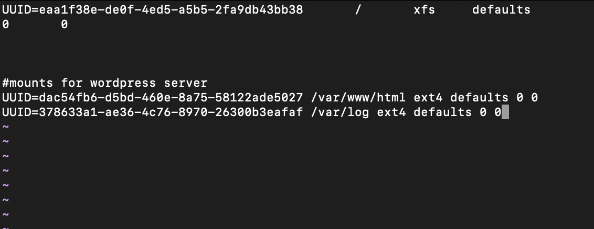
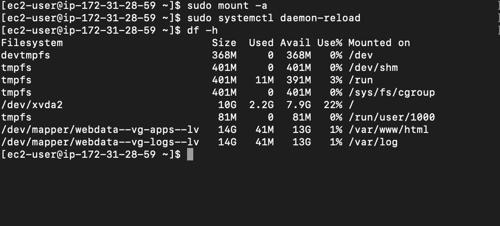

# Implementing Wordpress-Web-Solution

## 1. Preparing Web Server

* Create an EC2 instance server on AWS

* On the EBS console, create 3 storage volumes for the instance. These serves as additional external storage to our EC2 server.

* Attach the created volumes to the EC2 instance

* SSH into the instance, then view the disks attached using `lsblk` command

* View all mounts and free spaces on the server using `df -h`

* Create a partition on each volume using `gdisk`

* Install LVM2 package to create logical volumes on the server

* Create Physical Volumes on the partitioned disk volumes
`sudo pvcreate <partition_path>`

* Then, add up each physical volumes into a volume group
`sudo vgcreate <grp_name> <ppv_path1>...<pv_path1000>`

* Create logical volumes for the volume group
`sudo lvcreate -n <lv_name> -L <lv_size> <vg_name>`

* Our logical volumes are to be used as filesystems for storing application and log data.
* Creating filesystems on the both logical volumes

* Web contents to be used by the apache webserver are stored in the `/var/www/html` folder. A directory for collecting log data was also created

* The filesystem was mounted on the apache directory `/var/www/html`. Also the logs filesystem was mounted on the log directory `/var/log`

* Mount logs logical volume to var logs

* Restoring back var logs data into var logs 

## Persisting Mount Points

* To ensure that all our points are not erased on restarting the server, we persist the mount points by configuring the `/etc/fstab` directory

* `sudo blkid` to get UUID of each mount points

* `sudo vi /etc/fstab` to edit the file

* Testing mount point persistence

