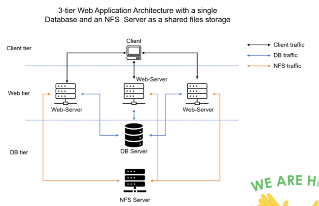
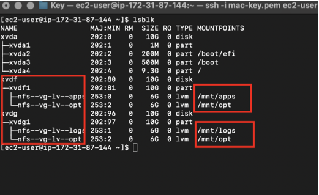
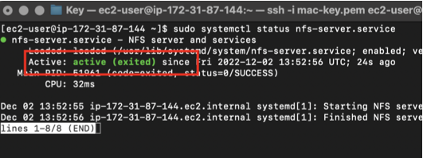
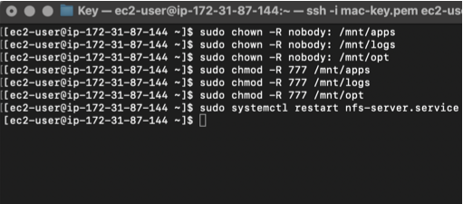
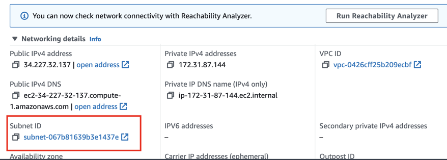

# DevOps Website Solution
In previous project [Implementing Web Solution (https://github.com/Zeighnab/DevOps_Project/tree/main/6_Website_Solution_With_Wordpress)] I implemented a WordPress based solution that is ready to be filled with content and can be used as a full fledged website or blog. Moving further I will add some more value to my solution so that a member of a DevOps team could utilize.

In this project,, I will be introducing the concept of file sharing for multiple servers to share the same web content and also a database for storing data related to the website.

## Architectural Design



On the diagram above we can see a common pattern where several stateless Web Servers share a common database and also access the same files using Network File Sytem (NFS) as a shared file storage. Even though the NFS server might be located on a completely separate hardware – for Web Servers it looks like a local file system from where they can serve the same files.

This project consists of the following servers:

* Web server(RHEL)
* Database server(Ubuntu + MySQL)
* Storage/File server(RHEL + NFS server)

## Preparing NFS Server

Create an EC2 instance (Red Hat Enterprise Linux 9 on AWS) on which we will setup our NFS(Network File Storage) Server.

On this server we attach 2 EBS volumes 10GB each as external storage to our instance and create 3 logical volumes on it through which we will attach mounts from our external web servers.

* 3 logical volumes `lv-opt`, `lv-apps` and `lv-logs`.
* 3 mount directory `/mnt/opt`, `/mnt/apps` and `/mnt/logs`.
* Webserver content will be stores in `/apps`, webserver logs in `/logs` and `/opt` will be used by Jenkins



Steps taken to create logical volumes are shown in this [project](https://github.com/Zeighnab/DevOps_Project/tree/main/6_Website_Solution_With_Wordpress).

Installing nfs-server on the nfs instance and ensures that it starts on system reboot
```
sudo yum -y update
sudo yum install nfs-utils -y
sudo systemctl start nfs-server.service
sudo systemctl enable nfs-server.service
sudo systemctl status nfs-server.service
```





Restart NFS server `sudo systemctl restart nfs-server`

Note: In this project, we will be creating our NFS-server, web-servers and database-server all in the same subnet

Next we configure NFS to interact with clients present in the same subnet. 

We can find the subnet ID and CIDR in the Networking tab of our instances

