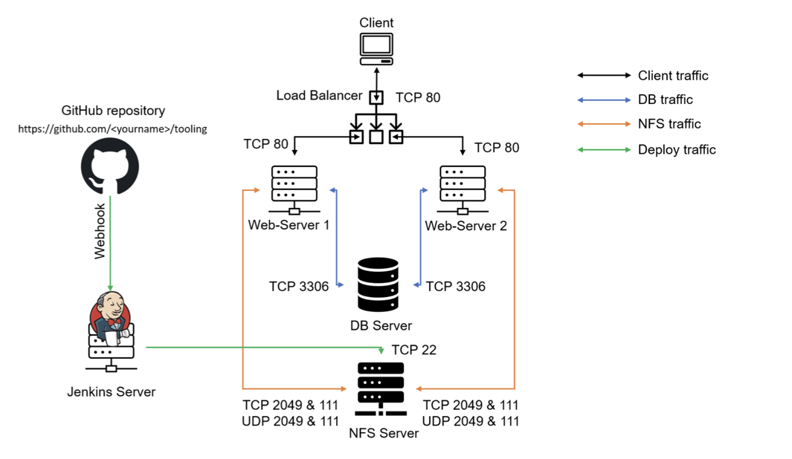
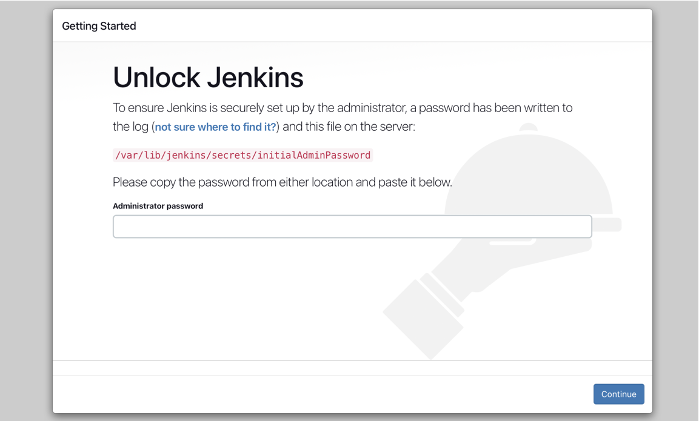

# CI/CD On DevOps-Website-Solution

## Introduction

Jenkins is an open-source Continuous Integration server written in Java for orchestrating a chain of actions to achieve the Continuous Integration process in an automated fashion. Jenkins supports the complete development life cycle of software from building, testing, documenting the software, deploying, and other stages of the software development life cycle.


In this Project, Jenkins was used to automate code delivery to NFS Server

## Jenkins Web Architecture for CI Builds



## Installing Jenkins Server

* Spun up a web server on AWS cloud and SSH into it.

* Installing JDK which is an important Java based package required for Jenkins to run.

* Note: You can automate this using userdata (in the advanced section) when launching the EC@ instance
```
#!/bin/bash
sudo apt update -y
sudo apt install openjdk-11-jdk -y
sudo apt install maven -y
curl -fsSL https://pkg.jenkins.io/debian-stable/jenkins.io.key | sudo tee \
  /usr/share/keyrings/jenkins-keyring.asc > /dev/null
echo deb [signed-by=/usr/share/keyrings/jenkins-keyring.asc] \
  https://pkg.jenkins.io/debian-stable binary/ | sudo tee \
  /etc/apt/sources.list.d/jenkins.list > /dev/null
sudo apt-get update -y
sudo apt-get install jenkins -y
sudo systemctl enable jenkins
sudo systemctl start jenkins
sudo systemctl status jenkins
###
```


* Since Jenkins runs on default port 8080, open this port on the Security Group inbound rule of the jenkins server on AWS


* jenkins is up and running, copy and paste jenkins server public ip address appended with port 8080 on a web server to gain access to the interactive console. `<jenkins_server_public_ip_address>:8080`



* The admin password can be found in the '/var/lib/jenkins/secrets/initialAdminPassword' path on the server.


## Attaching WebHook to Jenkins Server

* On the github repository that contains application code, create a webhook to connect to the jenkins job. To create webhook, go to the settings tab on the github repo and click on webhooks. Webhook should look like this `<public_ip_of_jenkins_server>:8080/github-webhook/`


## Creating Job and Configuring GIT Based Push Trigger

* On the jenkins server, create a new freestyle job


* In configuration of the Jenkins freestyle job choose Git repository, provide there the link to the GitHub repository and credentials (user/password) so Jenkins could access files in the repository. Also specify the branch containing code


## Configuring Build Triggers

* Specify the particular trigger to use for triggering the job. Click "Configure" on the jenkins job and add these two configurations

1. Configure triggering the job from GitHub webhook:


2. Configure "Post-build Actions" to archive all the files – files resulted from a build are called "artifacts".


* At this point, our architecture has pretty much been built, lets test it by making a change on any file on the Github repository and then push it to see the triggered job


* The console output shows the created job and the successful build. In this case the code on Github was built into an artifact on our Jenkins server workspace. Find the artificat by checking the status tab of the completed job .


* Our created artifact can be found on our local terminal too at this path `/var/lib/jenkins/jobs/tooling_github/builds/<build_number>/archive/`


## Configuring Jenkins To Copy Files(Artifact) to NFS Server

* To achieve this, we install the `Publish Via SSH` pluging on Jenkins. The plugin allows one to send newly created packages to a remote server and install them, start and stop services that the build may depend on and many other use cases.

* On main dashboard select "Manage Jenkins" and choose "Manage Plugins" menu item.

* On "Available" tab search for "Publish Over SSH" plugin and install it


* Configure the job to copy artifacts over to NFS server. On main dashboard select "Manage Jenkins" and choose "Configure System" menu item.

* Scroll down to Publish over SSH plugin configuration section and configure it to be able to connect to the NFS server:

* Provide a private key (content of .pem file that you use to connect to NFS server via SSH/Putty)

  * Hostname – can be private IP address of NFS server 
  * Username – ec2-user (since NFS server is based on EC2 with RHEL 8) 
  * Remote directory – /mnt/apps since our Web Servers use it as a mointing point to retrieve files from the NFS server

* Test the configuration and make sure the connection returns Success. Remember, that TCP port 22 on NFS server must be open to receive SSH connections.


* We specify `**` on the `send build artifacts` tab meaning it sends all artifact to specified destination path(NFS Server).


* Now make a new change on the source code and push to github, Jenkins builds an artifact by downloading the code into its workspace based on the latest commit and via SSH it publishes the artifact into the NFS Server to update the source code.


* This is seen by the change of name on the web application


