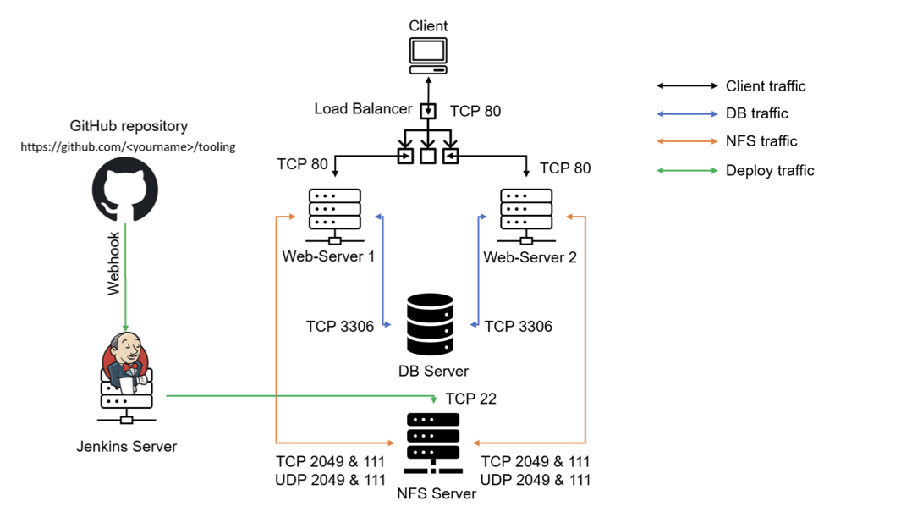
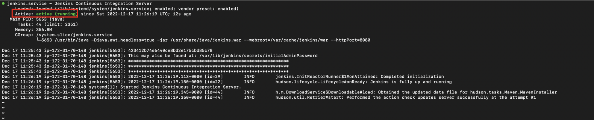
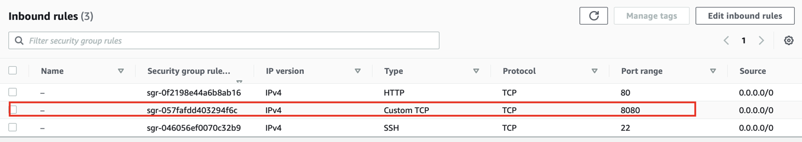
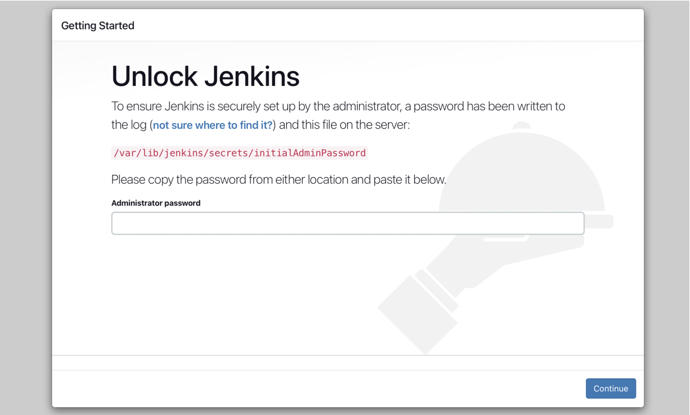

# CI/CD On DevOps-Website-Solution

## Introduction

Jenkins is an open-source Continuous Integration server written in Java for orchestrating a chain of actions to achieve the Continuous Integration process in an automated fashion. Jenkins supports the complete development life cycle of software from building, testing, documenting the software, deploying, and other stages of the software development life cycle.


In this Project, Jenkins was used to automate code delivery to NFS Server

## Jenkins Web Architecture for CI Builds



## Installing Jenkins Server

Spun up a web server on AWS cloud and SSH into it.

Installing JDK which is an important Java based package required for Jenkins to run.

* Note: You can automate this using userdata (in the advanced section) when launching the EC@ instance
```
#!/bin/bash
sudo apt update -y
sudo apt install openjdk-11-jdk -y
sudo apt install maven -y
curl -fsSL https://pkg.jenkins.io/debian-stable/jenkins.io.key | sudo tee \
  /usr/share/keyrings/jenkins-keyring.asc > /dev/null
echo deb [signed-by=/usr/share/keyrings/jenkins-keyring.asc] \
  https://pkg.jenkins.io/debian-stable binary/ | sudo tee \
  /etc/apt/sources.list.d/jenkins.list > /dev/null
sudo apt-get update -y
sudo apt-get install jenkins -y
sudo systemctl enable jenkins
sudo systemctl start jenkins
sudo systemctl status jenkins
###
```



Since Jenkins runs on default port 8080, open this port on the Security Group inbound rule of the jenkins server on AWS



Jenkins is up and running, copy and paste jenkins server public ip address appended with port 8080 on a web server to gain access to the interactive console. `<jenkins_server_public_ip_address>:8080`

