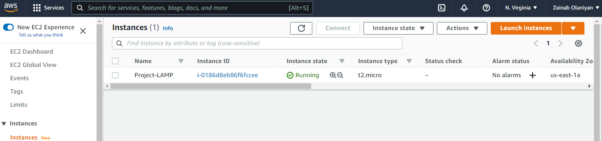
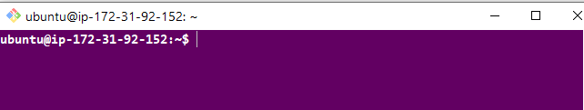

# Deploying a LAMP Stack Web Application on AWS Cloud

A LAMP Stack is a typical framework used in the development of web applications or software products. It comprises of Linux, Apache, MySQL, and Python,Perl or PHP.

Linux: This is an operating systtem on which the application is created, and it is also used in its deployment.

Apache: This is a web server that processes requests and serves web assets and content via HTTP

MySQL: A relational database management system used in creating and maintaining dynamic databases.

Python, Perl or PHP: A programming language used in execution of the web application.

## Creation of an EC2 Instance
We create an EC2 Ubuntu VM instance on AWS and and download the .pem key

on git bash, `cd` into the directory containing the .pem key and `ssh` into the instance

`ssh -i <privatekey.pem> username@ip-address`

## Setting Up Apache Web Server

Install apache web server using ubuntu package manager ==apt==:
`$ sudo apt install apache2`

![]

#starting apache2 server
`$ sudo systemctl start apache2`

#enable apache2 to start automatically upon system boot
`$ sudo enable apache2`

#checking apache2 status
`$ sudo systemctl status apache2`

![]

Green text indicate that the service is active and running

## Configuring Security Group Inbound Rule on EC2 Instance
A Security Group acts as a virtual firewall for EC2 instances to control incoming (Inbound), and outgoing traffic (Outbound).

We need to open the TCP port 80 to allow inbound rule to ensure the webpages are being accessed on the internet.

![]

To check the accessbility of our web server on the internet, we ==curl== the IP address/DNS name of our localhost

`curl http://127.0.0.1:80 or curl http://localhost:80`

![]

To check if our web application server can respond to requests, use the public ip address of our instance on a web browser. ==http://<Public-IP-Address>:80==

![]

## Installing MySQL

MySQL is a relational database that helps store and manage data.

